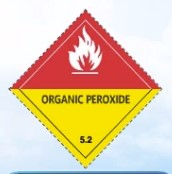
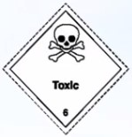
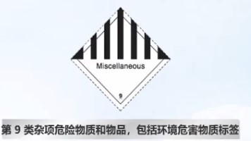
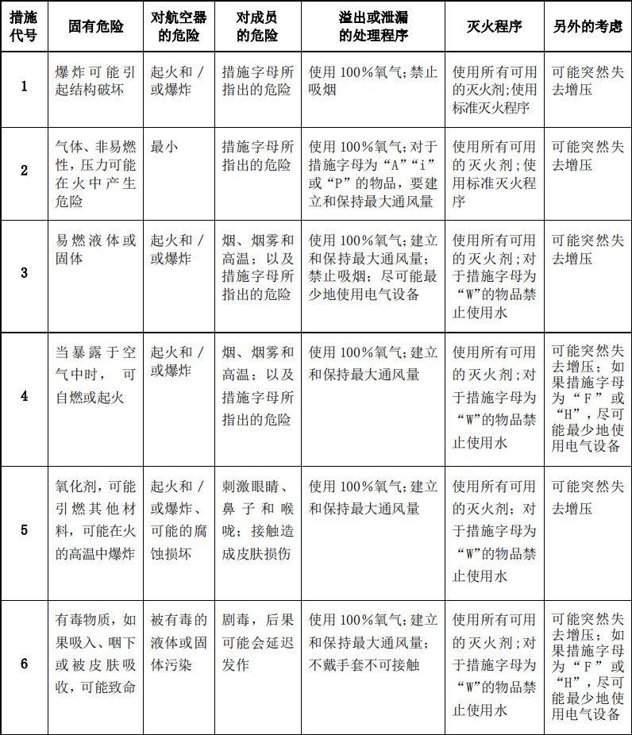

- [初训题](./recurrent/)

# 总则

## 危险品定义

- 危险品是指在航空运输中，能对健康．安全，财齐或环境构成危险，并在《技术细则》的危险品表中列明和根据此规则进行分类的物品和物质。本手册中用语，除在具体条款另有描述外，其含义与现行有效的《民用航空危险品运输管理规定》一致.

## 危险品运输和法律法规依据

- 芝加哥公约附件十八
  - 芝加哥公约是 1944 年在美国芝加哥签订的，该手册在签订时总共签订了十八个附件，而第十八个附件便是有关危险品运输的，已包含了管理危险物品国际航空运输的总原则。
- 危险物品安全航空运输技术细则（TI）
  - 《危险物品安全航空运输技术细则》简称《技术细则》，详述了附件 18 的基本规定，并且包含了危险品国际安全航空运输必须的所有详细要求。《技术细则》每两年更新一次。
- 危险品规则 DGR
  - 《危险品规则》与《技术细则》的规定一致但考虑到行业要求和操作要求，《危险品规则》中的的某些规定比《技木细则》中的规定更加严格。
- 与危险物品有关的航空器事故征候应急响（红皮书）
  - 红皮书是 ICAO 专门为机组人员编制的，它的主要内容是如何处理应急情况，书中简述了货舱的等级、灭火设施等内容，最为重要的是危险物品不安全事故检查单、应急处置设施表和带有措施代号的危险物品表的说明。
- 《民用航空危险品运输管理规定》（交通部令 2016 年第 42 号）应指南(CCAR-276-R1))
  - 为了加强民用航空危险品运输管理，保障飞行安全，根据《中华人民共和国民用航空法》和国务院的规定，制定了本管理规定。《民用航空危险品运输管理规定》（交通部令 2016 年第 42 号）简称 CCAR-276-R1，自 2016 年 4 月 13 日发布，2016 年 5 月 14 日起施行。

## 国航运输危险品总政策

- 国航运输危险品总政策
  - 遵守中华人民共和国及有关国家适用的法律、法规、命令、要求及有关的国际公约、行业标准，并接受国家主管部门的监督管理。
- 危险品运输要求
  - 连续性
    - 及时修订 《危险品运输手明》及《危险品培训大纲》
  - 有效性
    - 取得危险品航空运输许可
- 应急事故征候报告
  - 及时向国家主管部门、以及发生事故/事故征候、严重违规行为的所在国主管部问报告危险品事故/事故征候、严重违规行为井进行应急处置。
- 危险品装载位置
  - 驾驶舱及乘有旅客的客舱不得装载作为货物运输的危险品。
  - “仅限货机”的危险品不得装载在客机上及载有非机组成员的货机上。
- 危险品运输相关操作人员及管理、业务规章制定人员，按公司《危险品培训大纲》的要求接受符合岗位要求的培训
- 公司物资中的危险品
  - 运输的公司物资（COMAT）中含有危险品时，
    - 必须符合危险品航空运输的要求。
    - 应具备危险品托运人资质或委托有资质的危险品托运人代理人进行运输。
- 国航收运与不收运的危险品
  - 收运
    - 运输符合 IATA《危险品规则》要求的 1-9 类的危险品
    - 油漆
    - 集运货物固体二包化碳（普通货物冷冻剂用）
  - 不收运
    - 符合 1-9 类要求的部分危险品也不能运输
    - 例外数措危险品（从中国始发）
    - 烟花爆竹（从中国始发）
  - 只有一份分运单的集运货物
    一个主运单下同一托运人不同收货人的多个分运单的集运货物，只能含有第 9 类杂项危险品（不包括 UN3480、UN3090）。
    不同托运人/收货人的多个分运单的集运货物，只能含有 ID8000，消费品和/或 UN1266，香水产品，千冰。
- 与危险品运输有关的单位必须配备本手册及大纲；行李及货物危险品收运部门除本手册外还必须配备现行有效的 IATA《危险品规则》（DGR）
  - 飞行部门
    需要配置的手册有国航《危险品运输手册》和《机上危险品事故应急处理手册》
- 危险品收运部门
  - 在明显处张贴危险品宣传挂图
  - 在危险品存储和操作场所张贴
    - 公司印刷的危险品存储指南、
    - 当地相应的应急处理程序 和
    - 应急电话。
- 客运销售和办理乘机手续部门
  客运销售和办理乘机手续部门要在操作现场明显处和相关系统页面中，张贴、上传有关危险品的宣传品，包括宣传画及文字等。在办理相关手续时，认真履行对旅客的告知责任。
- 《危险品运输手册》的使用要求
  - 各相关运行系统/单位应根据公司手册的政策、程序和标准，结合自身特点和 DGR 的具体操作要求，制定本系统/单位的管理程序及操作（包括应急、报告）流程和指南，以明确各部门职责并确保相关岗位的人员了解本手册中与其职责相关的内容，在工作中获得有关信息，使其能够履行职责。
  - 有关运行单位按要求向机长提供机长通知单（NOTOC），向运行控制人员提供机长通知单（NOTOC）或提供能涵盖机长通知单（NOTOC）所载有的危险品信息。
- 各相关运行系统/单位
  - 各相关运行系统/单位应根据公司手册的要求，制定本系统/单位的检查制度并建立相应检查单，收运部门建立自查制度和收运检查单。

## 相关人员职责

- 飞行人员职责
  - 负责掌握“机长通知单”的内容和危险品的装机位置
  - 在“机长通知单”上签字
  - 拒绝破损或泄漏的危险品装上飞机
    - 发生事故
      - [x] 机长通知单
      - [x] 通知空中交通管制（ATC）和飞行签派
      - [x] 按应急处置程序进行操作
- 危险品托运人职责
  - 托运人托运危险品时，旅客的托运、手提行李及随身物品中含有危险品时，除必须严格遵守中国和有关国家的法律、法规、命令或要求外，还应遵守相关的国际公约
  - 托运人交运的危险品，旅客的托运、手提行李及随身物品中含有的危险品应符合国航及国货航的相关规定，如需要其它承运人参与运输的，还应遵守相关承运人的规定
  - 托运人及旅客必须保证所托运或携带的物品不属于禁止航空运输的物品，并为此承担责任
  - 托运人必须保证依据 IATA《危险品规则》对其所托运的货物准确地识别、分类、包装、加标记、贴标签、提供真实准确的危险品运输相关文件，国际航空运输时，除始发国要求的文字外，危险品运输文件应当加用英文。托运国家法律、法规限制运输的危险品，应当符合相关法律、法规的要求。
  - 托运人应当对航空货运单（以下简称货运单）、托运人危险品申报单（以下简称申报单）上所填写的关于货物的说明和声明的真实性和正确性负责。因货运单和申报单上所填写的关于货物的说明和声明不符合规定、不正确或者不完全，给承运人或者承运人对之负责的其他人造成损失的，托运人在承担赔偿责任的同时对承运人首先承担赔偿责任。
  - 托运人必须保留一份危险品运输相关文件至少**24 个月**。上述文件包括危险品运输文件、航空货运单及国家、经营人等要求的补充资料和文件
  - 禁止夹带危险品或以非危险品品名托运危险品，禁止匿报、谎报危险品
  - 托运国家法律、法规限制运输的危险品，应当提供相应主管部门的有效证明。因没有此种证明，或者此种证明不充足，或者不符合规定造成的损失，除由于承运人或者其受雇人、代理人的过错造成的外，托运人应当对承运人承担责任。
  - 托运人应确保所有办理危险品运输准备工作和签署申报单的人员已按规定接受相关危险品知识培训并合格。
  - 托运人的代理人代表托运人从事危险品航空运输活动的，承担托运人责任，并按规定接受相关危险品知识的培训并合格。
  - 托运人应遵守现行有效《民用航空危险品运输规定》和国际民航组织《技术细则》中所列的托运人责任。
- 国航职责
  - 取得相关民航局的危险品航空运输许可并在载明的范围和有效期内开展危险品航空运输活动
  - 对危险品运输航站实施危险品运输资质管理。
  - 对危险品进行符合国际民航组织《技术细则》和《民用航空危险品运输规定》的要求的收运、存储、装载、检查、提供信息、保存运输记录工作。
  - 制定防止行李、货物、邮件及供应品隐含危险品措施制定应急措施
  - 建立危险品保安措施，制定高威胁危险品保安计划
  - 制定《危险品运输手册》并保持有效
  - 制定《危险品培训大纲》，获得局方批准并保持有效。
  - 获得危险品培训机构资质并按照《危险品培训大纲》实施培训
  - 与货运销售代理人签订涉及危险品航空运输的货运销售代理协议；对货运销售代理人进行管理并对其危险品培训大纲进行认可
  - 认可并向民航局报备符合民航局关于货物航空运输条件鉴定机构相关 规定的鉴定机构，并向托运人告知 -与地面服务代理人签订涉及危险品航空运输的地面服务代理协议，并按照规定报民航地区管理局备案，所委托的中国境内的地面服务代理人应当符合本规定有关地面服务代理人的要求，所委托的中国境外的地面服务代理人应当符合所在地国家的相关法律、法规
  - 对地面服务代理人和货运销售代理人的货物查验及相关措施进行认可并定期检查
  - 作为地面服务代理人向其他公司提供地面服务时，向当地局方报备。在代表经营人从事危险品航空运输活动时，履行经营人的相关责任
  - 按照局方规定，报送有关危险品运输活动的运输信息

## 章节测试

1. 《机上危险品事故应急处理手册》包括：

   - [ ] 旅客和机组携带危险品的规定
   - [x] 应急处置措施表
   - [ ] 危险品的标记与标签
   - [x] 危险物品事故检查单

2. 《民用航空危险品运输管理规定》是中国政府危险品航空
   运输管理的主要法规之一。

   - 对

3. 危险品应急处置措施表应在下列哪本手册中查找？

   - [ ] 国航《危险品运输手册》
   - [x] 国航《机上危险物品事故应急处理手册》

4. 与危险品运输相关的人员必须定期接受危险品培训，并取
   得合格成绩，且每二十四个日历月需要复训一次。

   - 对

5. 危险品在空中发生紧急情况时，在时间允许的情况下，机组人员应将机长通知单中危险品信息通知空中交通管制和飞行签派。

   - 对

6. 未取得危险品航空运输许可的航空公司，不得承运危险品。

   - 对

7. 国航收运从中国始发的烟花爆竹。

   - 错

---

# 危险品运输限制

## 禁止运输的危险品

- 禁止运输的危险品
  - 易爆炸
  - 发生危险反应
  - 产生火焰或危险的热量
  - 易释放毒性、腐蚀性的发散物
  - 易燃气体或蒸汽的物质
  - 《技术细则》中规定的在任何情况下都禁止航空运输的物品和物质
- 符合上述描述的一些已知的危险品已在 IATA《危险品规则》第 4.2 章节危险品表中列明“禁止运输”。
  - 不可能将所有在任何情况下都禁止航空运输的危险品一一列出，因此对该类物质的交运应格外注意，以保证这类物品不会被交付运输。
- 运输符合 IATA《危险品规则》要求的 1-9 类的危险品但不运输：
  - 除放射性物质例外包装件，自中国始发的含有危险品的航空邮件
  - 从中国始发的烟花爆竹
  - 除放射性物质例外包装件，自中国始发例外数量包装件
  - 含有危险品的集运货物，下述情况除外：
    - a.只有一份分运单的集运货物。
    - b.一个主运单下同一托运人不同收货人的多个分运单的集运货物，只能含有第 9 类杂项危险品（不包括 UN3480、UN3090）。
    - c.不同托运人/收货人的多个分运单的集运货物，只能含有 ID8000，消费品和/或 UN1266，香水产品，干冰。
  - 含有液体危险品的单一包装（包括复合包装），除非使用坚固的集合包装
  - 客机上不运输 A 级感染性物质（（UN2814,UN2900），但运输中国疾病预防控制中心（包括各地疾控中心），和解放军疾病控制所（包括各中心疾控中心）及中国农业部（包括各地兽医部门）托运的除外

## 隐含危险品的预防

- 隐含危险品
  - 在托运人按照一般情况申报的货物/邮件中，可能隐含有某些危险品，而这些危险品不易从托运人申报中确定其属性。
- 收运人员应该如何识别隐含危险品？
  - 首先各户收运部门必须建立隐含危险品识别程序。
  - 必须将隐含危险品收运检查单纳入到程序中。
- 货物品名：
  - 疑似危险品
  - 无法识别是否属于危险品
  - 与公司《危险品运输手册》第 2.3.2 章节隐含危险品的典型实例（或 IATA《危险品规则》第 2.2 章节中“隐含危险品品名表”）的名称相一致
    **应使用隐含危险品收运检查单做进一步识别**
- (语音识别)
  - 首先我们就来看一下之前说过的**野营用具**
    - 根据危险品运输手册 2.3.2 野营设备中很有可能包含一些易燃气体，丁烷，丙烷等
    - 易燃液体，煤油汽油等
    - 易燃固体，四大六甲还和其他危险物品。
  - 了解完野营设备，我们再来看看**潜水设备**吧，你知道下列潜水设备中哪些含有危险品吗？没错，潜水设备中可能含有装有
    - 压缩气体的钢瓶。
    - 潜水呼吸器
    - 及救生衣上的气瓶内含氧气或空气，
    - 在空气中运转时，可能产生极高热量的高照明度的潜水灯具。
      - 因此潜水灯在运输的过程中，为载运安全，灯泡或电池必须断开连接。
  - 接下来我们再看看**冷冻食品**吧，冷冻食品可能含有危险品吗？ 是的，因为冷冻食品的包装内可能含有
    - 固体二氧化碳
    - 干冰等。
  - **电动轮椅**可能还有危险品吗？是的，你说的没错，因为里边可能含有
    - 湿电池、
    - 锂电池
    - 或燃料电池。
    - 含有或曾经含有燃油的燃料电池箱。
  - 我们再来看看**牙科器具**吧，牙科器具也可能含有危险品。比如含有
    - 易燃树脂
    - 或溶剂压缩
    - 或液化气体汞
    - 或放射性物质。
  - 当然隐含危险品还远远不止这些，如公司物资汽车零部件，影片摄制组或媒体器具等，很多看其申报的名称，似乎不属于危险品。但仔细检查其中所包含的内容，据可能含有危险性的物品。
    - 而这就需要我们的相关工作人员在收运货物时认真检查，这样才能保证不放过任何一件会引发危险的货物，确保运载的安全进行。
- 预防隐含危险品的措施：
  - 在各货物收运部门张贴宣传画，提示托运人不得按普通货物运输危险品
  - 在货物订舱和销售部门张贴隐含危险品贴画，增强相关人员的预防意识
  - 加强对收运人员的相关培训、加强对货物销售代理人及地面服务代理人的培训
  - 利用危险品鉴定机构对性质不明的物品进行鉴定
- 对于行李中隐含的危险品的预防从三方面入手：
  - 通过第 16 章中要求的信息告知和宣传向旅客告知国航关于行李中的危险品的相关规定
  - 与行李收运相关的旅客服务人员应将所服务区域内出现的关于行李中危险品的特殊情况及时通报/协调安检等相关部门
  - 对于在行李收运过程中发现的不符合相关规定的危险品拒绝运输

## 旅客和机组人员携带的危险品

### (语音识别)

- 我们都知道危险品户需要装载在飞机货舱里，那么旅客和机组人员在新行李中是否可以携带危险品呢？
  - 可以的，国行危险品运输手册 16.9 中对旅客和机组人员携带的危险品作出了相应的规定。
  - 那么你又是否知道国航危险品运输手册 16.9 是如何使用的吗？
    - 呃，这个就不知道了，那么现在就让我来给你介绍一下吧。
    - 通过国航危险品运输手册 16.9，我们可以查到危险品运输方式的相关规定。有些危险品的携带是必须经航空公司同意的。
    - 承运危险性较大的危险品，必须以机长通知单的形式通知机长危险品装机位置。
    - 下面让我们通过几个例子来了解一下。
      - 首先来看看**用于医疗目的的小型氧气瓶和含气态或者液态的气体钢瓶**。
        - 从表格中我们可以知道，该类危险品
        - 不允许手提，托运和随身携带，
        - 因此他不需要考虑是否需经承运人同意，和是否需要通知机长装机位置。
      - **锂电池驱动的**电动代步车，如平衡车，滑板车，自行车的不允许手提，托运和随身携带。
      - 接着我们来看看**弹药类**的危险品，
        - 他们不允许作为手提行李和随身携带，
        - 但是可以作为托运行李运输，
        - 并且运输过程中需要经过承运人同意和通知机组装机的位置。
      - 下面再来看看**野营炉和含有易燃液体的燃料罐**，带有排空的燃料罐或燃料箱这类危险品，同样
        - 不允许作为手提行李和随身携带。
        - 可以作为托运行李运输，
        - 并且运输过程中需要经过承运人同意。
        - 但是与弹药不同的是，她不需要通知机组装机位置，
      - 最后我们再来看看装有防漏型湿电池或其他符合特殊规定 a123 和 a199 的**电池的轮椅或其他电动代步工具**。
        - 这类危险品与弹药类的基本一致，
        - 不允许作为手提行李和随身携带，
        - 但是可以作为托运行李运输，
        - 并且运输过程中需要经过承运人同意合同制机组装机的位置。
      - 介绍到这里，李刚，你知道应该如何使用附件表，16.9 了吧。嗯，知道了，呵呵，现在正好有两个乘客遇到了问题，去试试看，你能不能帮他们解决吧。
      - 乘客 A 想要带**医用水银温度计**，那么他可以通过哪种方式携带？
        - （托运行李）
      - 乘客 B 携带了用于移植用的**人体活器官**，它是否可以顺利通过？
        - (可以)

### (非音频)

- 人体活器官运输原则
  - 旅客需提供《移植中心器官接受确认书》；
  - 运输专用容器上应贴有《人体器官运输专用标志》
  - 优先办理，优先座位，行李优先运输，优先起飞

## 公司物质中的危险品

- **不受本手册规定限制**的危险品
  - 航空器上安装的物品和物质
  - 机上供应品
  - 用于机上餐食制冷剂的干冰
  - 机上配备的含有锂电池的个人娱乐设施和读卡器
- 公司物资中的危险品一航空器上安装的物品和物质
  本来已归类为危险品的物质，按照适航和运行规章的要求或为满足其它特殊用途，被安装或放置在公司运行的飞机上，这些物品和物质不受本手册有关危险品运输的规定的限制。
  - 公司物资中的危险品一消费品（机上供应品）
    `航空公司在航班上使用及销售的气溶胶、酒精饮料、香水、古龙水，这些都是不受危险 品运输手册限制的危险品。`
  - 公司物资中的危险品一含有锂电池的飞行数据包、供个人娱乐的机上电子设备、信用卡读卡器等
    `允许运营人在航空器上运载含有锂电池的飞行数据包、供个人娱乐的机上电子设备、信用卡读卡器，以及这些设备的备用电池（要特别注意电池的防短路措施）。`
- 那么是不是所有航空器材上的危险品都不受该手册的限制？
  - 这种说法是错误的。
  - 航空器材中的危险品如化学氧气发生器、气体钢瓶、飞机发动机、飞机滑梯、救生衣、 蓄电池、油漆等在**作为货物运输**时，必须符合本手册规定，按照危险品办理运输。
- (补充) 16.2.8.6 产生高热的物品
  水下照明装置和焊接设备等一旦启动会产生高热,可能导致起火的电池驱动设备，必须拆下电池或发热元件,以防止意外启动。拆下的电池应做好防短路措施。

## 章节测试

1. (√) 旅客可以托运一支医用水银温度计，且不需要经承运人同意。
2. 电气设备（Electrical Equipment）中可能含有哪些危险品？
   - [x] 开关或电子管内可能含有磁性物质或汞
   - [x] 湿电池
   - [ ] 易燃固体
   - [ ] 毒性物质
3. (×) 航材中的危险品在满足适航条件下，不受危险品相关规定的限制，当作为货物运输时，仍然不受限制。
4. (×) 使用锂离子电池（电池可以拆卸）驱动的电动代步工具，其拆下的锂离子电池可以作为托运行李运输。
5. (√) 为旅客提供的机上娱乐设备及信用卡读卡机（内含锂池），可不受危险品运输规则限制。
6. (√) 符合要求的备用锂电池，禁止作为托运行李运输。
7. (√) 含有爆炸品、压缩气体、锂电池等危险品的电击器（如泰瑟枪），禁止在手提，托运和随身行李中携带。
8. 测试样品（Sample for testing）中可能含有哪些危险品?
   - [ ] 放射性物质
   - [x] 感染性物质
   - [x] 易燃液体
   - [x] 腐蚀性物质
9. (√) 含有锂金属或锂离子电池芯或电池组的便携式电子设备：如：手表、计算器、相机、手机、手提电脑、摄像机等。当旅客或机组人员用于个人使用时，可以作为手提或托运行李运输 。
10. 公司物资（Company Materials)中可能含有哪些危险品?
    - [x] 化学氧气发生器
    - [x] 湿电池
    - [x] 氧气瓶
    - [x] 火柴
11. (x) 产生热能的物品，例如水下手电筒，潜水灯具禁止旅客携带 。
12. 火炬、发光棒（Torches）中可能含有哪些危险品?
    - [x] 易燃气体
    - [ ] 易燃液体
    - [ ] 易燃固体
13. (x) 旅客在托运行李中可以携带最多不超过 10kg 的安全子弹。
14. 在托运行李中携带用做制冷剂的干冰，每位旅客最大允许重量为：
    - [x] 2.5 千克
    - [ ] 5 千克
    - [ ] 4 千克
15. 以下旅客行李中，不需要在特殊装载机长通知单中注明的是：
    - [ ] 子弹
    - [ ] 政府气象局代表携带的水银温度计或气压计
    - [ ] 装有可溢漏电池或锂电池的电动轮椅
    - [x] 含烃类气体的卷发器
16. 汽车、汽车零部件（Automobiles、Automobiles parts）中可能含有哪些危险品?
    - [x] 磁性物质
    - [x] 灭火瓶
    - [x] 轮胎中的压缩气体
    - [x] 气囊组件

---

# 危险品分类

## 一般规定

- (语音识别)
  - 在复习危险品的分类之前，让我们先来看看危险品分类的一般规定吧。
  - 根据危险品所具有的不同类型，危险性质，危险品分为 9 类。
  - 其中某些类别有进一步划分为若干想根据危险品所具有的危险程度不同，危险品可以划分为三个包装等级。
  - 还记得这九类危险品中有**哪几个是分项**的吗？请选择。
    - 如图中所看到的，第三类，第七类，第八类和第九类没有分项。
    - 第一类，第二类，第四类，第五类和第六类有分项，
      - 其中第一类分成六项，
      - 第二类分成三项，
      - 第四类分成三项，
      - 第五类分成两项，
      - 第六类分成两项。
- (笔记)
  - 包装等级
    - I 级包装 (最危险)
    - II 级包装
    - III 级包装 (最不危险)
  - **包装等级的危险程度和放射性等级是相反的**

## 危险品类别和项别

### (笔记)

- 第 1 类：爆炸品
  - 1.1 具有同时爆炸危险物质和物品
  - 1.2 具有喷射危险但无重大爆炸危险的
  - 1.3 具有燃烧危险或者较小爆炸或者喷
  - 1.4 无重大危险的物质和物品
  - 1.5 具有同时爆炸危险但很不敏感货物
  - 1.6 没有整体爆炸危险的极不敏感物品
- 第 2 类：气体
  - 2.1 易燃气体
  - 2.2 非易燃气体
  - 2.3 有毒气体
- 第 3 类：易燃液体
- 第 4 类：易燃固体、易于自燃物质和遇水释放易燃气体的物质
  - 4.1 易燃固体
  - 4.2 易自燃物质
  - 4.3 遇水放出易燃气体的物质
- 第 5 类：氧化性物质和有机过氧化物
  - 5.1 氧化物质
  - 5.2 有机过氧化物
- 第 6 类：毒性物质和感染性物质
  - 6.1 有毒物质
  - 6.2 感染性物质
- 第 7 类：放射性物质
- 第 8 类：腐蚀性物质
- 第 9 类：杂项

## 章节测试

1. 包装等级表示危险品的危险性大小和包装的严格程度，下列包装等级中，危险性最大的是
   - [x] PGI
   - [ ] PGI
   - [ ] PGⅢ
2. (√) 含有二氧化碳气体的碳酸饮料不受危险品手册的限制。
3. 干扰飞机导航系统的物质，属于以下哪类/项？
   - [ ] CLASS 8
   - [x] CLASS 9
   - [ ] DIV. 4.3
4. 容易燃烧或摩擦容易起火的固体，属于以下哪类/项？
   - [ ] 第 4 类
   - [x] 4.1 项
   - [ ] 4.2 项
5. (×) 4.3 项的危险品可以使用水进行灭火。
6. 严重损伤与之接触的生物组织的液体，属于以下哪类/项：
   - [x] CLASS 8
   - [ ] CLASS 9
   - [ ] DIV. 6.1
7. 危险物品没有分项的是
   - [ ] CLASS 1 3 7 8
   - [x] CLASS 3 7 8 9
   - [ ] CLASS 2 4 7 8
8. (√) 如果锂电池按照危险品货物运输应按照第 9 类危险品运输。
9. (√) 含有感染性物质的活体动物禁止航空运输。
10. (√) 属于 1.1、1.2、1.5、1.6 项的全部爆炸品禁止航空运输。
11. (√) 客机、货机都可以运输 1.4S 的爆炸品。
12. 下列危险品中，不属于第 9 类危险品的是
    - [ ] 锂电池
    - [ ] 紧急救生滑梯
    - [ ] 磁性物质
    - [x] 湿电池
13. (×) 放射性物质分为三个放射等级，|级放射性物质危险性最大。

---

# 危险品的包装、标记和标签

## 一般包装要求

- (语音识别)

  - 这就是咱们公司的危险品装载仓库，所有的危险品托运人都要事先进行包装，再交由航空公司托运，是吗？
  - 是的下面的时间，我会跟你介绍一些关于危险品包装的要求和包装类型方面的知识。好的。
  - 你知道吗？
  - 国内货物运输及从中国境内始发的国际货物运输的危险品包装，应取得《中华人民共和国出入境检验检疫局出境危险货物运输包装使用鉴定结果单》。在 IATA《危险品》中另有规定的除外。

- 包装要求
  - 外包装编号
    - 阿拉伯数字
      - 包装的种类或包装
    - 英文字母
      - 包装材料的种类
  - 内包装编号
    - IP
      - 内包装 INNER PACKAGING
    - 阿拉伯数字
      - 内包装的种类
    - 大写字母
      - 内包装的更细分类
- 航空运输的危险品所使用的包装物应当符合下列要求：
  - 包装物应当构造严密，能够防止在正常运输条件下由于温度、湿度或者压力的变化，或者由于振动而引起渗漏
  - 包装物应当与内装物相适宜，直接与危险品接触的包装物不能与该危险品发生化学反应或者其他反应
  - 包装物应当符合《危险品规则》中有关材料和构造规格的要求
  - 包装物应当按照《危险品规则》的规定进行测试
  - 对用于盛装液体的包装物，应当能承受《危险品规则》中所列明的压力而不渗漏
  - 内包装应当以防止在正常航空运输条件下发生破损或者渗漏的方式进行包装、固定或者垫衬，以控制其在外包装物内的移动。垫衬和吸附材料不得与包装物的内装物发生危险反应
  - 包装物应当在检查后证明其未受腐蚀或者其他损坏时，方可再次使用。再次使用包装物时，应当采取一切必要措施防止随后装入的物品受到污染
  - 如果由于之前内装物的性质，未经彻底清洗的空包装物可能造成危害时，应当将其严密封闭，并按其构成危害的情况加以处理
  - 包装件外部不得粘附构成危害数量的危险物质

## 包装类型

- (语音识别)
  - 下面跟你介绍包装的类型，包装的类型可以分为联合国规格包装和非联合国规格包装两种。
  - 带有 UN 标识的包装是联合国规格包装标示如图所示，


- 接着我们了解一下危险品包装的两种方式，及单一包装和组合包装
  - 单一包装是没有内外包装的。
  - 而组合包装是由内外包装组合完成的。
- 下面我们再来看看非联合国规格的包装，
  - 它包括限制数量包装，例外数量包装及钢瓶的包装等等。
  - 这里我们看一下**集合包装**
    - 集合包装件是指为了便于作业和装在，一个托运人用于装入一个或者多个包装件。并组成一个操作单元的一个封闭物。
  - 最后我们来看一下**All packed in one**包装的图片

 - All packed in one 包装指的就是两种或两种以上的危险品。符合隔离要求的放在同一高程线中。 - 学习了以上内容，下面来做一个小测试吧！

## 标记

- (语音识别)
  - (废话)
    - 前面提到包装完成之后，需要在包装件上做相关的标记。
    - 是的，那快跟我讲讲包装件上有哪些标记吧，
    - 呵呵，别急，接下来我们就来学习标记的相关知识，首先我们先来了解一下识别，标记，使用及特殊要求。
  - 危险品的基本标记包括运输专用名称，UN 编号，托运人，收货人名称及地址。
  - 现在让我们先来看看危险品包装的识别标记吧，
    - 1. 运输专用名称。每个装有危险品的包装件，必须标示运输专用名称，如需要技术名称，应将其一在运输专用名称后表示。
    - 2. UN 编号，UN 或 ID 编号应在靠近运输专用名称的地方标示,其编号前一定要冠以 UN 或 ID 字母。
    - 3. 托运人，收货人要求名称齐全，地址详细。
  - 对于标记部分是不是只能使用，始发国要求的文字？
    - 不是的，在国际运输中，对于文字部分的标记，除使法国要求的文字外，还应使用英文。
  - (**一般要求**)
  - 所有危险品标记都不能被任何
    - 粘贴物或
    - 其他任何标签
    - 标记
      所覆盖。
  - 所需标记不得和其他有可能减弱标记效果的其他表情粘贴在一起。
- (笔记)
  - 标记必须要
    - 1. 用印刷或其它标记方式固定在包装件的外表面上，保证其持久耐用
    - 2. 清晰可读，容易识别
    - 3. 能够使用于露天环境且不会被减弱效果
    - 4. 颜色要与背景有反差
  - 特殊要求
    - 对爆炸品的要求
      - 爆炸品的运输专用名称可以用表示其商业或军用名称的其他文字说明来补充
    - 对危险品净数量的要求及固体二氧化碳（干冰）的要求
      - 每一包装件必须注明所含危险品的净数量
      - 固体二氧化碳的净重必须标在任何装有该物质的包装件上
    - 对感染性物质的要求
      - 必须在包装件表面标注有关负责人的姓名、地址和电话号码
      - 该负责人应具备处理该感染性物质的突发事件的能力
    - 对第 2.2 项深冷液化气体的要求
      - 必须用箭头、向上标签标出包装件的直立方向
      - 包装件的每一侧面或桶形包装件每隔 120 度角应印上 “KEEP UP RIGHT（保持直立）”
      - 包装件表面必须印上“DO NOT DROP-HANDLE WITH CARE （勿摔-小心轻放）"
      - 包装上面还必须附上托运人关于运输该危险品的应急措施
    - 包含 UN3373 的包装件的标记要求
      - 应标记"BIOLOGICAL SUBSTANCE,CATEGORY B（生物物质，B 级）”
      - 若包装件内含有冷冻用的干冰，应在包装上显示干冰的净重
      - 包装上应有 UN3373 标记
    - 呼吸保护装置中含化学氧气发生器并按照特殊规定 A144 运输
      - 在包装标记靠近运输专业名称的地方显示如下声明：
      - Air Crew Protective Breathing Equipment (smoke hood) in accordance with Special Provision A144（机组呼吸保护装置（烟雾）按照特殊规定 A144 运输）
    - 对限制数量的要求
      - 在包装件上必须粘贴限制数量的标记

 - 集合包装件的标记 - 如果集合包装件内所有的危险品标记看不清必须在集合包装件外表面标出文字“OVERPACK”、UN/ID 编号、运输专用名称、 “LIMITED QUANTITIES"（如适用）及其他规定标记。

## 标签

### 危险性标签

- [百度文库](https://wenku.baidu.com/view/8268ed839989680203d8ce2f0066f5335b816704.html)

#### (笔记)

- 第 1 类：爆炸品
  - 1.1 具有同时爆炸危险物质和物品
  - 1.2 具有喷射危险但无重大爆炸危险的
  - 1.3 具有燃烧危险或者较小爆炸或者喷
  - 1.4 无重大危险的物质和物品


- 1.5 具有同时爆炸危险但很不敏感货物
- 1.6 没有整体爆炸危险的极不敏感物品
- 第 2 类：气体
  - 2.1 易燃气体


- 2.2 非易燃气体


- 2.3 有毒气体


- 第 3 类：易燃液体


- 第 4 类：易燃固体、易于自燃物质和遇水释放易燃气体的物质
  - 4.1 易燃固体


- 4.2 易自燃物质


- 4.3 遇水放出易燃气体的物质


- 第 5 类：氧化性物质和有机过氧化物
  - 5.1 氧化物质


- 5.2 有机过氧化物



- 第 6 类：毒性物质和感染性物质
  - 6.1 有毒物质



- 6.2 感染性物质


- 第 7 类：放射性物质


- 第 8 类：腐蚀性物质


- 第 9 类：杂项




##### 危险性标签-使用

- 若一种具有多重危险性的物品在危险品表中未具体列出其名称，必须根据规定来确定它的主要危险性及其相应的标签。
- 对于第 1 类爆炸品，必须注意：
  - 要求贴第 1.1、1.2、1.3、1.4F、1.5 和 1.6 项爆炸品标签的包装件，通常为航空禁运（极少有例外）。
- (语音识别)对于 5.1 项氧化物质和 5.2 项有机过氧化物，必须在氧化型物质标签底部标注 5.1，在有机过氧化物标签底部标注 5.2。
- 次要危险性为第 6.1 项的第 8 类危险品，若其毒性只产生于对组织的破坏作用，则不必粘贴第 6.1 项次要危险性标签。
- 第 9 类杂项危险品包括环境危害物的包装件必须使用第 9 类危险物质和物品标签。在包装件内含磁性物质时，必须用磁性物质标签来代替杂项危险物质和物品标签。

##### 危险性标签-粘贴

- 基本要求
  - 必须按照《危险品规则》（IATA）的规定粘贴标签
  - 与运输无关的标签必须除去
  - 标签应粘贴正确位置上
- 粘贴质量
  - 必须牢固地粘贴在或印制在包装件上，且全部可见
  - 标签所处的背景必须与标签形成鲜明的颜色对比
  - 一个标签不得贴在包装的不同面上
  - 若包装表面无法粘贴标签，可使用硬质的拴挂标签
- 粘贴位置
  - 在可能的情况下，标签应紧临托运人、收货人的地址粘贴
  - 次要危险性标签应紧临主要危险性标签粘贴
  - 若包装尺寸允许，标签必须同运输专用名称标记粘贴在包装的同一表面
- 对集合包装件的特别要求
  - 若内部包装件上的标签不能从外面全部看见，这些标签必须还要在集合包装件的外表面粘贴
- 对特殊形状包装件要求
  - 粘贴在桶形包装件或细长包装件上面的标签不得自身重叠
- 对拥有多包装的外包装要求
  - 两种及两种以上的危险品装在同一外包装内时，必须在外包装上显示所有内装危险品的所需标签，相同的标签无需重复。
- 对标签脱落的处理
  - 危险品在收运后及在运输途中发现，危险品标签脱落由操作部门负责重新粘贴
  - 运输危险品的航站及部门要备有足够的危险品标签

### 操作性标签

- (操作性标签概述)
  - 危险性标签主要显示出其危险性，而操作标签、标记则表示操作危险品时的注意事项。
  - 操作性标签、标记说明此危险品在运输过程中的操作事项，可以单独使用，也可以与危险性标签一起使用。
- 标签图例
  - CAO 标签 (**仅限货机**)
    - 用在仅限货机运输的危险品包装件上


- 磁性物质标签
  - 用在装有磁性物质的包装件或集合包装件上


- 深冷液化气体标签


- 电动轮椅及辅助行动器材标签


- 锂电池标签


- 远离热源标签


- 向上操作标签


- 放射性物质例外包装件标签


- 例外数量标记


- 危害环境物质标记


- B 级生物组织标记


- 限制数量标记


- 转基因微生物及转基因生物物质标记


- 操作标签-使用
  - 除放射性物质外装有液体危险品的包装件，必须使用**向上标签**。
    - 以下包装件除外：
      - 内容器所装物为不超过 120 毫升的易燃液体
      - 主容器所装物为不超过 50 毫升的感染性物质
    - 在标签底部的横线下面可写上“Dangerous Goods”
    - 在包装件的两个相对侧面上，至少各粘贴一个“向上”标签，或至少预先各印制上一个“向上”标签
      - 同时，可在包装件或集合包装件的顶面印上“THIS SIDE UP"或“THIS WAY UP"
  - (语音识别) 含有冷冻液体的包装件和集合包装件上的深冷**液化气体标签必须与非易燃气体危险性**标签同时使用。
  - 4.1 项自身反应物质和 5.2 项有机过氧化物的包装件和集合包装件上。除展示相映的危险性标签外，还应同时使用**远离热源**标签。
  - **仅限货机**标签必须用在只能用货机运输的危险品包装件上。
- 操作标签-粘贴
  - 其次是操作标签的粘贴。
  - 操作标签，除了要遵循危险性标签中提到的粘贴规则外，还需注意:
    - 仅限货机标签必须紧邻危险性标签粘贴
    - 向上标签，箭头方向必须保持向上。
      - 承装液体的危险品组合包装间集集合，包装间必须使用向上标签。表示包装件的方向。
      - 对于集合包装件，内部包装件上的方向标签必须与集合包装件上的一致。

## 章节测试

### 指出下列标签、标记的中文名称。

.jpg>) 放射性物质

 易燃固体

 感染性物质

 仅限货机

### 有一件单一危险性的危险品包装件上贴有


- 则我们还需要用到以下哪个标签？
  - [x] 
  - [ ] 
  - [ ] 
  - [ ] 

---

# 危险品的装载

## 装载原则

- 预先检查原则
  - 危险品的包装件在组装集装器和装机之前，必须进行认真检查。包装件在完全符合要求的情况下，才可继续进行作业，检查的内容包括:
    - 外包装无漏洞，无破损，包装件无气味无任何泄漏及损坏的迹象。
    - 包装件上的危险性标签和操作标签粘贴牢固。
    - 包装件上的文字标记字迹清楚。
- 方向性原则
  - 对于有方向性标签或标记的危险品货物。操作人员在搬运，装卸，组装集装板，或集装箱以及装机的全过程中。必须按该指向，使包装件始终保持直立向上。
- 轻拿轻放原则
  - 在搬运或装卸危险品包装件时，无论是采用人工操作还是机械操作，都必须轻拿轻放。切记磕、碰、摔、撞！
- 固定货物，防止滑动原则
  - 危险品包装件，被装入集装器或飞机货舱后装载人员应将它们在货舱内固定住。以免危险品在飞机飞行中滑动或倾倒，危险品包装件的装载，应该符合如下要求：
    - 体积小的包装件不会通过网孔从集装板上掉下
    - 散装的包装件不会在货舱内移动
    - 用其它货物卡住散装的包装件时，必须从五个方向（前、后、左、右、上）卡紧
    - 如果集装箱中的货物未装满（已经使用的容积不超过总容积的三分之二），应将货物固定

## 隔离原则

- 有些不同类别的危险物品，相互接触时可以发生危险性很大的化学反应，称之为性质抵触的危险物品。
  - 不相容的危险品也应在收运、操作、装机时采取隔离措施
  - 考虑到我国政府主管部门的与此相关的规定


- 注 1：S 配装组的爆炸品可与所有配装组的爆炸品一起码放
- 除 1.4B 项的爆炸品的规定外，不同配装组的爆炸品可装在一起，不论其是否属于同一项别
- 注 2：1.4B 项的爆炸品不得与 1.4S 项以外的其他爆炸品装在一起。当 1.4B 爆炸品与 1.4S 以外的其他爆炸品装载在同一飞机时，必须分别装载在不同的集装器内，装机时集装器之间必须由其他货物分隔开并保持最小距离 2 米。如不使用集装器装载，1.4B 必须与其他的爆炸品装载在不同且不相邻的位置且之间用其他货物隔离最小 2 米的距离
- 注 3：锂电池与其他危险品的隔离参见《危险品规则》9.3.2.1.3
- 性质抵触的危险品
  - RCX
    - Piv1.3 Explosive compt.C
    - 1.3 项爆炸品 C 配装组
  - RGX
    - Piv1.3 Explosive compt.G
    - 1.3 项爆炸品 G 配装组
  - RXB
    - Piv1.4Explosive compt.B
    - 1.4 项爆炸品 B 配装组
  - RXC
    - Div1.4Explosive compt.C
    - 1.4 项爆炸品 C 配装组
  - RXD
    - Div1.4Explosive compt.D
    - 1.4 项爆炸品 D 配装组
  - RXE
    - Div1.4Explosive compt.E
    - 1.4 项爆炸品 E 配装组
  - RXG
    - Div1.4Explosive compt.G
    - 1.4 项爆炸品 G 配装组
  - RXS
    - Div1.4Explosive compt.S
    - 1.4 项爆炸品 S 配装组
  - RFG
    - Flammable Gas
    - 易燃气体
  - RNG
    - Non. Flammable Gas
    - 非易燃无毒气体
  - RPG
    - Toxic Gas
    - 毒性气体
  - RFL
    - Flammable Liquid
    - 易燃液体
  - RFS
    - Flammable solid
    - 易燃固体
  - RSC
    - Substance Liable to Spontaneous Combustion
    - 自燃物质
  - RFW
    - Dangerous When Wet
    - 遇水释放易燃气体的物质
  - ROX
    - Oxidizer
    - 氧化剂
  - ROP
    - Organic Peroxide
    - 有机过氧化物
  - RPB
    - Toxic
    - 毒性物质
  - RIS
    - Infectious Substance
    - 传染性物质
  - RRW
    - Radioactive.White
    - 放射性物质—白色
  - RRY
    - Radioactive.Yellow
    - 放射性物质—黄色
  - RCM
    - Corosive
    - 腐蚀性物质
  - RMD
    - Miscellaneous Dangerous Goods
    - 杂项危险物品
  - ICE
    - Dry lce
    - 干冰
  - MAG
    - Magnetized Material
    - 礠性物质
  - RCL
    - Cryogenic Liquid
    - 深冷液化气体
  - CAO
    - Cargo Aircraft Only
    - 仅限货机
  - RSB
    - Polymeric Beads
    - 聚合物颗粒
  - AVI
    - Live Animal
    - 活体动物
  - HUM
    - Human Remains
    - 灵枢
  - RBI
    - Fully Regulated Lithium lon Batteries as per IA and IB of P1965
    - 按照包装说明 965IA 和 IB 的锂离子电池
  - RLI
    - Fully Regulated Lithium lon Batteries as per Section of P1966 and 967
    - 按照包装说明 966-967 第一部分的锂离子电池
  - ELI
    - Lithium lon Batteries excepted as per Section II of PI965-967
    - 按照包装说明 965-967 第二部分的锂离子电池
  - RBM
    - Fully Regulated Lithium Metal Batteries as per IA and IB of PI968
    - 按照包装说明 968IA 和 IB 的锂金属电池
  - RLM
    - Fully Regulated Lithium Metal Batteries as per d Section I of PI969-970
    - 按照包装说明 969-970 第一部分的锂金属电池
  - ELM
    Lithium Metal Batteries excepted as per Section II of P1968-970
    - 按照包装说明 968-970 第二部分的锂离子电池
  - (锂电池补充 - 来源于《更新与差异课程》)
    - EBI:
      - Fully regulated lithium ion batteries as section II
    - EBM:
      - Fully regulated lithium metal batteries as section II
  - (补充 - 来源于口述)
    - PER
      - 鲜活易腐货物
    - EAT
      - 食品
- 危险品与其他特种货物的隔离表


- 除此之外不用隔离
- 装载原则
  1. 性质抵触的危险品，在任何时候不能相互接触或相邻放置。
  2. 装在集装板上，或在货仓内散装的情况下，可采用如下方式。
     - 将两种性质抵触的危险品包装件，分别用尼龙带固定在集装板或飞机货舱地板上。两者的间距至少 1m。

## 装载要求

### 放射性物质

- 从之前的危险品分类中，我们可以知道放射性物质分为三个等级。而不同等级的方式性物质又有不同的装载要求：
  - 其中**一级**，白色方式性物质包装件，可以装在任何机型的飞机货舱内。既无数量限制，也无特殊要求。
  - 而**二级和三级**的方式性物质则有以下限制：
    1. 每个放射性物质包装件的运输指数不得超过 10。
    2. 每架客机非裂变放射性物质包装件的总运输指数不得超过 50。每家货机非裂变放射性物质包装件的总运输指数不得超过 200。对于裂变放射性物质，客、货机上总临界安全指数不得超过 50。
    3. 放射性物质包装件在客机货舱内的限制: 放射性物质包装件在货机货舱内的限制。见 11.2.C 表


 - 试题 1. 若一件放射性物质运输指数 TI=5.5，则放射性物质与人员的最小隔离距离是 - [x] 1.15m - [ ] 1.0m 2. 如有两件放射性物质的包装件放在货舱内，其运输指数分别为 TI=5.5，TI=3，两件放射性物质水平隔离距离是 - [ ] 1.15m - [x] 3.45m - [ ] 1.0m - [ ] 1.55m

- （1）未显影的摄影底片被射线照射后将会完全报废。Ⅱ 级一黄色和 Ⅲ 级一黄色放射性物质包装件与未冲洗的摄影胶卷或胶片的最小间隔距离，按 11.2.D 表确定。
- （2）间隔距离的大小与包装件的总运输指数和照射时间有关。


- 放射性物质和活体动物的隔离
  - 运输时间小于 24 小时，最小间隔距离为 0.5 米
  - 运输时间大于 24 小时，最小间隔距离为 1 米

### 磁性物质

- 不得将磁性物质装载于直接影响飞机的直读磁罗盘或罗盘传感器的位置上。
- 磁性物质应装在飞机**后部的货舱**内。

### 作为制冷剂运输的干冰的运输要求


- 干冰=>活体动物危险性：
  1. 是放出二细化碳气体，使人员及动物窒息
  2. 是降低周围温度，使动物及其它对温度敏感的货物受到损害
- 所以为了活体动物在运输过程中不会受到干冰的影响，在运输中活体动物和干冰不能同时装载在没有通风的货舱中。有关货舱通风情况参考《货物装载手册》。
- 同舱装载时活体动物的装载位置要高于干冰的装载位置，并且不能相邻装载。装载限量见表 11.2.B。
- 遇到相对每一机型有大批干冰作为货物运输时，其装载限制可按所列数值的两倍计算。
- 装有干冰的货舱舱门应在临起飞前关闭
- 飞机在经停站着陆时，都应打开舱门，以利空气流通而降低货舱内的二氧化碳浓度
- 如果需要装卸货物，必须待货舱内空气充分流通后，工作人员才可进入货舱进行装卸作业

### 易燃易爆货物的装载

- 在对易燃易爆货物进行装载时装载运输主要和次要危险性为:
  - 一类爆炸品，
  - 三类易燃液体，
  - 四类易燃固体，易燃物质，遇水释放易燃气体的物质。
  - 五类氧化剂和有机过氧化物和
  - 2.1 项易燃气体的危险区，包括货物中的锂电池，
  - 要求装载在烟雾探测与灭火系统正常的货舱中。
  - 当相关设备故障，做故障保留时，按故障保留程序通知国货航。由国货航通知货运各相关单位采取相应措施。
  - 不同国家和承运人对于危险品带装载有其特殊的要求，在运输过程中应与严格执行。不同国家和承运人对于危险品的装载特殊要求见 IATA DGR 2.8。
  - 此外，再进行装载操作时，应参与机长通知单上的隔离条件。
  - 最后我们来看看**第 4.1 和 5.2 项**危险品的装载，在整个装载过程中，含有第 4.1 项中的自身反应物质，或 5.2 的有机过氧化物的包装件，或集装器。应避免阳光直射，远离热源且通风良好，且必须粘贴远离热源的标签。

## 危险品集装箱设备的装载

- 如果危险品装入集装器运输，货物组装完毕后，应在集装器上悬挂集装器挂牌。
- 我们来仔细看看危险品集装器挂牌，从图片中我们可以看到他所列出的唯一限制的信息。
  - 装机位置
  - 货物名称
  - 是否仅限货机

## 货机装載原则

- 仅限货机的包装件或集合包装件在装机时应符合如下之一要求：
  - 装载在飞机 C 级货舱
  - 使用的集装箱配置了火情探测/扑救设备，该设备具有与 C 级货舱相同的由国家主管部分颁发的证书要求，达到标准的集装器必须在集装器挂牌上有“C 级货舱”的字样。
  - 在紧急情况下，机组或其他授权人员能够接近、处理并且在尺寸和重量允许情况下将仅限货机包装件或集合包装件与其他货物分离。如果仅限货机危险品装载在集装板上，该集装板要能够使机组或其他授权人员接近。
- 贴有仅限货机标签的的包装件或集合包装件可以在起飞前机组要求的检查下查看
- 不可运输:
  - 次要危险性不是 8 类的 Ⅲ 级包装的易燃液体（第 3 类）
  - 毒性物质和感染性物质（第 6 类）
  - UN3528,易燃液体动力内燃发动机或易燃液体动力燃料电池发动机或易燃液体动力内燃机或易燃液体动力燃料电池机
  - 放射性物质（第 7 类）
  - 杂项危险物质和物品，包括危害环境的物质（第 9 类）
  - UN3529，易燃气体动力内燃发动机或易燃气体动力燃料电池发动机或易燃气体动力内燃机或易燃气体动力燃料电池机。
  - 注意:
    - 仅限货机的危险品不能装载在除符合 C 级标准的集装箱外的集装箱中
    - 参见货航手册
- 仅限货机的危险品**装入客机**的预防应注意以下几点：
  - 禁止将仅限货机的危险品装入客机
  - 订舱时将 CAO（仅限货机代码）录入系统
  - 对照货邮舱单查看是否有仅限货机的危险品，如果有，查看标签是否牢固、是否被配装到客机航班上。
  - 监装人员或搬运人员客机下发现贴有“仅限货机”标签的货物，及时拉下并报告。

## 章节测试

1. RPB 是哪类危险品的操作代码？
   - [ ] 毒性气体
   - [ ] 感染性物质
   - [x] 毒性物质
2. 一票放射性物质装载在货舱内，其 TI=4.5，此放射性物质与人员的最小隔离距离是（）。
   - [ ] 1.15 m
   - [x] 1.0m
   - [ ] 0.85m
3. (√) 如果危险品装入集装器运输，货物组装完毕后应在集装器上栓挂集装器挂牌。
4. 第七类放射性物质不需要与下列哪些物质进行隔离？
   - [ ] 种蛋
   - [ ] 活体动物
   - [x] 食品
   - [ ] 未冲洗的胶卷
5. 以下哪种货物不是特种货物？
   - [ ] 干冰
   - [ ] 鲜活易腐货物
   - [ ] 湿电池
   - [x] 衣服
6. (√) 放射性物质|级包装件可以装载在任何机型的飞机货舱。
7. 下列危险品哪些需要隔离？
   - [ ] 3 和 7
   - [x] 5.1 和 4.2
   - [ ] 5.1 和 4.3
   - [ ] 1.4S 和 8
8. (√) 磁性物质应装载在飞机后部的货舱。

---

# 危险品运输文件与信息提供

## 危险品识别表的介绍

- A 栏
  - UN orID No.（UN 或 ID 编号）：
  - 本栏列出的是该危险品的 UN 或 ID 编号。
- B 栏
  - Proper Shipping Name/Description （运输专用名称/说明）
  - 本栏列出物品或物质的运输专用名称和限制说明。
- C 栏
  - Class or Division(Subsidiary Hazard) （类别或项别（次要危险性））
  - 本栏列出的物品或物质，按照 IATA《危险品规则》第三章分类标准划分的类别或项别及在括号中显示的次要危险性。
- D 栏
  - Hazard Label(s)（危险性标签及操作标签）：
  - 本栏列出的物品或物质的包装件或集合包装件外部应粘贴的危险性标签及必要的操作标签。
- E 栏
  - PG（包装等级）：
  - 本栏列出联合国包装等级，即物品或物质所指定的包装等级、IⅡ、Ⅲ 级。
- F 栏
  - EQ（例外数量危险品代码）：
  - 本栏包括按照物质或物品包装等级确定的例外数量危险品代码（见 DGR2.6.4.1 和表 2.6A)
- G 栏
  - Pkg Inst（客机和货机限量包装说明）
- H 栏
  - Max Net Qty Per Pkg(客机和货机每个限量包装件的最大净数量）：
  - H 栏列出物品或物质在客机上运输时，每个包装件内允许盛装的最大净数量。
- I 栏
  Pkg Inst（客机和货机包装说明）。
- J 栏
  - Max Net Qty Per Pkg(客机和货机每个 包装件的最大净数量）：
  - 本栏列出物品或物质在货机上运输时，每个包装件内允许盛装的最大净数量。
- K 栏
  - Pkg Inst（仅限货机包装说明）
- L 栏
  - Max Net Qty Per Pkg(仅限货机的每个包装件的最大净数量）：
  - 本栏列出物品或物质仅限在货机上运输时，每个包装件内允许盛装的最大净数量。
- M 栏
  - s.p.See4.4（特殊规定)
- N 栏
  - ERGCode（应急措施代号）

## 机长通知单的使用

- 危险品运输文件
  - 货物托运书
  - 托运人危险品申报单
  - 航空货运单
  - 危险品收运检查单
  - **机长通知单**
  - 其它有关文件
- 空中出现紧急情况时
  - 运输专用名称，UN 编号
  - 危险品的类别项别（爆炸品包括配装组），次要危险性
  - 危险品的净重及装载位置
- 机长通知单
  - 特殊装载机长通知单（行李）
    - 关于危险品
  - 危险品货物机长通知单
    - 关闭危险品
  - 贵重物品机长通知单
  - 其他特种货物机长通知单
- 机长通知单格式和内容
  - 表头
    - 装机站(Station of Loading):
      填写装机站机场的三字代码。
    - 航班号(Flight No.):
      填写装载危险品的航班号。
    - 离港日期（Date)：
      填写离港的具体日期。
    - 飞机注册号(Aircraft Registration):
      填写飞机的注册号，如 B-2472。
    - 填写人签字（Prepared by):
      填写制作者姓名。
    - 检查人签字（Checked by）：
      填写检查人姓名。
    - 危险品应急电话：
      86-10-64599996
  - 内容
    - 卸机站（Station of Unloading）：
      填写卸机站机场的三字代码。
    - 货运单号码（Air Waybill No.）：
      按照《托运人危险品申报单》所示填写危险品的货运单号码。
    - UN 或 ID 编号，如适用，注明“RQ”或“LTDQTY”（UN or ID No. "RQ" or "LTD QTY" if applicable):
      按照《托运人危险品申报单》所示填写危险品的 UN 或 ID 编号；对于在北美航线上运输的危险品，如果是限制数量危险品（Dangerous goods in limited quantity）,还要在 UN 或 ID 编号后注明“LTD.QTY”；
      如果危险品数量超过了美国政府规定的报告数量，在 UN 或 ID 编号后注明“RQ”。
    - 运输专用名称（以英文为主）（ProperShipping Name)，如适用，注明豁免证书编号（Exemption No.,if applicable)：
      按照《托运人危险品申报单》所示填写危险品的运输专用名称，并按照国货航服务明电[2009]202 号《关于对危险品机长通知单运输专用名称栏增加中文译名的通知》执行；如果在北美航线 上，该运输专用名称的危险品在政府批准豁免的情况下运输，还要注明豁免证书编号，并按照“DOT-E 豁免编号”的形式表示。
    - 类或项（第 1 类爆炸品的配装组）（次要危险性）（Classor Division for Class Comp.Grp (Sub.Risk):
      按照《托运人危险品申报单》所示填写危险品的类别或项别，对于第一类爆炸品，还要注明配装组；如果危险品有次要危险性，在括号中注明次要危险性。
    - 包装等级（Packing Group）：
      按照《托运人危险品申报单》所示注明危险品相应的包装等级。
    - 包装件数（No.of Packages）：
      填写危险品货物的包装件数。
    - 包装类型和危险品数量（Type of Pkgs and Quantity）：
      填写危险品的净数量，单位用“L”或“KG”表示，如果是毛重，注明“kgG”。在北美航线上，还要按照《托运人危险品申报单》所示填写危险品的包装类型。包装类型可以用代码表示，如木箱可以表示成 4C 或 Wooden Box。
    - 第七类放射性物质（Radioactive Material For Class 7 Only)，核素名称（nuclide)，物理或化学状态（Physical or Chemical Form),级别（Category),运输指数（Trans index)：
      填写放射性物质的核素名称及放射级别和运输指数等内容。在北美航线上，要求填写放射性物质的核素名称，除钚（plutonium）-238、钚-239、钚-241 外，其余放射性物质可以使用核素代码，如 Co-60.在此栏中，还要按照《托运人危险品申报单》内容注明核素的物理和化学状态、放射级别和运输指数等内容。
    - IMP 代码（见背面）（IMP Code(See Reverse):
      注明危险品对应的 IMP 代码，代码及隔离要求见背面。
    - 仅限货机或客货机（CAOor PAX）：
      如果是仅限货机危险品，注明 CAO；如果是客货机运输的危险品，注明 PAX。
    - 集装器识别编号（ULDID）栏：
      注明装载危险品的集装器的编号，如 PMC68935CA.
    - 装机位置（Position）：
      注明危险品在货舱中的装载位置。
    - 变更后位置（Moved to Position）：
      如果危险品的装载位置发生变更，注明变更后的位置。
    - 应急措施代号（Drill Code）：
      注明机上危险品应急措施代码，如《DGR》中 4.2 表 N 栏所示。
  - 表底
    - 监装负责人签字（LoadingSupervisor' s Signature) :
      注明监装危险品的负责人的姓名。
    - 装载位置变更人签字（PositionChanged By):
      注明变更危险品装载位置人员的姓名。
    - 机长签字（Captain's Signature)
      执飞航班的机长签字。
    - 接班机长签字（Captain Signature):
      接班机长签字。

## 章节测试

1. 机长通知单分为：
   - [x] 特殊装载机长通知单（行李）
   - [x] 危险品货物机长通知单
   - [x] 特种货物机长通知单
2. 哪些危险品不需要填写危险品货物机长通知单？
   - [x] 例外数量危险品
   - [x] 磁性物质
   - [x] 转基因微生物及转基因生物体
   - [x] 放射性物质例外包装件
   - [x] 生物物质、B 级
3. (×) 危险品货物机长通知单的右上角印有公司的应急电话，但是没有危险品应急代码的相关信息。
4. 对于旅客行李中的危险品，哪些需要以机长通知单的形式通知当班机长？
   - [x] 满足收运条件的子弹
   - [x] 气象局携带的水银温度计
   - [x] 装有防漏型/非防漏型电池的电动轮椅
   - [x] 装有锂电池的电动轮椅
5. (×) 作为货物运输的干冰，必须填写《危险品货物机长通知单》；运输作为普通货物制冷剂的干冰，则无需填写《危险品货物机长通知单》。

---

# 危险品应急处理

## 危险品应急处理

如果出现危险品事故或征候，我们就必须按照公司制定的危险品应急处理及报告程序来操作。

## 一般规定

- 目的和依据
  - 制定危险品应急处置及报告程序的目的，是为了规范公司各部门及人员在实施处理危险品事故/征候的工作程序和措施，以保证应急处置及报告工作有效、有序进行。
  - 本程序是根据现行有效的《民用航空法》、《民用航空危险品运输管理规定》及其它民用航空规章制定。
- 使用范围
  - 中国国际航空股份有限公司危险品事故/征候应急处置及报告程序中的各项规定适用于本公司发生的事故/征候
- 要求
  - 作为公司应急处置程序的一部分，各分公司、基地、航站及相关部门参照《应急处置程序手册》，结合当地实际情况，制定相应的危险品应急处置子程序，所属各部门及人员按照程序中的规定实施应急处置。
  - 其中危险品事故/征候及危险品一般事件的报告涉及公司航空安全信息管理，各分公司、基地、航站及相关部门参照《航空安全管理手册》的相关规定，结合当地实际情况，制定相应的报告流程。

## 危险品事故、危险品征候、危险品一般事件

- 危险品事故
  - 造成致命或严重人身伤害或者重 与危险品航空运输有关联 大财产损坏或者破坏环境的事故
- 危险品症候
  - 不同于危险品事故，但与危险品航空运输有关联，不一定发生在航空器上，但造成人员受伤、财产损失、环境污染、起火、破损、溢出、液体或放射性物质渗漏或包装未能保持完好的其他情况。
- 危险品一般事件
  - 指与危险品航空运输有关联，违反《民用航空危险品运输管理规定》的行为，但不构成危险品事故或危险品事故征候的事件。

## 危险品事故/征候的报告要求

- (语音识别) 公司在发生空中和地面危险品事故征候及违规行为时，最先发现的单位，机组或个人，应当立即向本部门，上级领导或直接向公司 AOC 64599995/6 报告。报告的情况应当尽量准确，地点清楚，主动说明报告人的情况。我们先来了解一下我们公司危险品事故征候违规行为报告程序图，小李,你可要仔细看清楚哟！


- 报告的时间段分为 1 小时内，10 小时，24 小时，48 小时，直至调查结束报告。报
- 告责任单位分为飞行机组、公司，分公司，航空安全管理部门主管单位等有关部门。
- 下面我来学习报告的类型，危险品事故征候的报告类型分为
  - 初始报告，
    - 时限：在发生事故/征候的第一时间段 0-1 小时内
    - 方式：采取方便、易行
    - 内容：主要是事件发生的时间、地点位置、空域、飞机号、航班号、事故/征候发生简要情况、状态、准备或已经采取的应对措施等。
    - 责任单位：飞行机组、应急中心、征候发生单位或部门、事件知情人
  - 连续报告，
  - 情况简报，
  - 整个症候、发生处置情况报告、
  - 事故征候调查报告，
  - 事故处理报告，
  - 事后报告。
- (图片识别)
  - 事故/征候初始报告
  - 连续或滚动报告
  - 对于一般性地面危险品运输事故，不需要启动公司应急处置程序进行处置的
  - 事后报告

## 机上应急处理措施

### 应急手册中的检查单

- 危险品不安全事故检查单
  1. 遵循适当的航空器灭火或排烟应急程序
  2. 接通禁止吸烟信号牌
     - 当有烟雾或蒸汽存在时，应接通禁止吸烟信号牌，井在飞行的剩余时间里持续禁烟。
  3. 考虑尽快着陆
     - 鉴于任何危险物品不安全事故所带来的困难和可能造成的灾难性后果，应该考虑 应该提早而不是延迟做出在最近的合适的机场着陆的决定，如果延迟做出决定，当所载的危险物品出现事故征候可能发展到一个非常严重的状态时，会极大地限制操作上的灵活性。
  4. 考虑关闭非必要设备的电源
     - 因为不安全事故可能是由电力问题引起的，或因为电气系统可能受到任何不安全事故的影响，特别是因为灭火行动等，可能损坏电力系统，故应关闭所有非必要的电气设备。仅保持为那些对维持航空器安全必不可少的仪器、系统和控制装置供电。不要恢复电力，直至这样做确实安全时为止。
  5. 查明烟/烟雾/火的起源
     应查明任何烟，烟雾，火的来源。当查明事故征候的起源之后，才能切实有效地实施灭火或抑制火势程序。
  6. 对于发生在客舱内的危险物品不安全事故，参页考裕。务组检香单，并协调驾驶舱飞行组/客舱乘务组的行动
  7. 确定应急处置的措施代号
  8. 使用航空器应急处置方法图表上的指南帮助处理不安全事故
  9. 如果情况允许，通知空中交通管制部门及公司运行值班室 OCC 有关机上裁有危险物品的信则
  - 有一点需要注意的是，在美国运行时危险品征候、事故处置特殊要求。除了要根据美国运输部 DOT 的法规要求以外，当上美国运行的航班出现紧急情况时，飞行机组只需要将公司应急电话号码。报告当地空中交通管制 ATC，由空中交通管制 ATC，负责与公司应急电话联系。获得危险品的装载及应急处置有关系，积赞美国进行危险品运输的航空公司，要设置 24 小时应急电话。公司危险品运输 24 小时应急电话确定为 0086-10-64599996。

### 措施代码的含义

- (语音识别) 危险物品被查明后，应在危险品货物机长通知单上找到相应的应急处置措施代号。适用的应急处置措施代号，已在机长通知单上列明，如果没有给出也能通过机长通知单上列明的运输专用名称、或我联合国编号，在《机上危险品事故应急处理手册》中查到。可以按照字母排列顺序或数字排列顺序，找到相对应的应急处置措施代号。
  - 注：所提及的按字母顺序和按数字顺序排列内容，在
    - 本手册附录表 4-2 (字母顺序)
    - 和表 4-3 (按 UN 编号数字) 中。





- (语音识别) 是的，当机上发生危险品事故时，在飞机着陆之后，在打开任何货舱门之前，我们应该先安排旅客和机组成员下机。
  - 另外，货舱门打开时，应有应急服务人员在场。
  - 除此之外，我们还要通知地面人员，应急服务人员危险物品的性质及其存放地点。到达后，采取必要的步骤，为地面工作人员取出物品存放的位置，以可利用的最快方式传递所有关于该物品的信息。可能是包括一份危险货物机长通知单。
  - 最后，要在维修日志上做适当记录，TLB，说明需要对航空器进行检查，以确保任何危险物品的渗漏或溢出。均为损坏航空器的结构和系统，以及一些航空器设备如灭火器，应急处置包等可能需要补充或更换。

## 章节测试

1. (√) 飞行人员应遵循《危险品不安全事故检查单》，处置与危险品运输相关的事件与事故征候。
2. (×) 一票危险品，它的应急代码为 4PW，其灭火程序是：可以使用水作为灭火剂。
3. (×) 一票危险品，它的应急代码为 8F，对成员的危险为：易燃。
4. 以下信息中，可以从机长通知单中了解的是：
   - [x] 装机站
   - [x] 装机位置
   - [x] 货物的主要危险性
   - [x] 应急措施代号
5. (√) 在货舱内发生的不安全事故，应在试图打开货舱门之前，将旅客和机组成员撤离航空器，货舱门打开时应有应急服务人员在场。
6. (√) 当在美国运行的航班出现紧急情况时，飞行机组只需要将公司应急电话号码报告当地空中交通管制（ATC），由空中交通管制（ATC）负责与公司应急电话联系，获得危险品的装载及应急处置有关信息。
7. 如果在飞行中发生紧急情况，机长将按规定通知有关当局，通知事项如下：
   - [ ] 运输专用名称
   - [ ] 装载位置
   - [ ] UN 编号
   - [ ] 危险品的数量
   - [x] 以上均属
8. (√) 危险品的应急代码可以在机长通知单上找到。
9. (√) 代码为 UN3480 的危险品其应急代码是 12FZ。
10. (√) 某一危险品，其联合国编号为 UN1088，其运输专业名称为 Acetal，其应急代码 3H。
11. (√) 公司危险品运输 24 小时应急电话确定为：0086-10-64599996，设置在公司运行控制中心，印刷在 NOTOC 的右上角。

---

# 锂电池

## 锂电池的运输

中国民航局下发通知规定：旅客在坐飞机时，超过 160Wh（瓦特小时）的锂电池将严禁携带。

## 锂电池的常识

- 分为锂离子电池（主流）和锂金属电池
- 瓦特小时
  - WH =V × Ah
  - 例如 1000mAh、3.6V 的电池
  - =3.6 \* 1000 / 1000

## 锂电池航空运输规则和限制

- 按照货物运输的锂电池分为 Section II、Section II
  - 现阶段国航、国货航不运输 Section lA,Section IB 的锂电池
- 按照旅客行李运输
  - 锂电池额定瓦特小时 < 100Wh，不需要经过承运人同意
  - 如果 100Wh < 锂电池额定瓦特小时 ≤160Wh，- 必须经过承运人同意，并有书面标准，方可携带

## 锂电池航空运输的常见问题及防护措施

电池和电池动力设备运输是最主要的风险之一，就是电池两极接触其他电池、金属物体或其他导电体而引起的电池短路，因此，必须将包装好的电池芯和电池使用适当的方式隔开，以防止发生短路和电极破损。此外，电池和电池芯，还必须包装在坚固的外包装内，或者安装在设备中。

## 章节测试

1. (√) 对于便携式电子设备中的锂电池（100Wh<额定能量 ≤160Wh），最多允许旅客携带两块这样的备用电池。
2. (×) 按照 Section lⅡ 运输的含有锂离子电池的电子设备，不必粘贴任何标签。
3. (×) 锂电池驱动的电动轮椅，如果电池本身的设计允许其卸下，那么，此种锂电池没有瓦特小时的限制。
4. (×) 作为旅客行李运输的备用锂电池，可以作为托运行李运输。
5. (×) 如果按照危险品运输，锂电池应划分为第 4.3 项危险品。
6. (√) 含有锂离子电池的设备其应急代码为 12FZ。
7. 按照 Section Il 运输的锂电池货物应粘贴什么样的标签？

- [x] 
- [ ] 
- [ ]  

---

# 飞行员危险品复训（10 类）更新与差异课程

## 引言

(语音识别) 大家好，欢迎大家来参加飞行人员危险品更新差异培训，我叫周焕宇，来自于培训部职业发展培训中心。那么大家经历了六个小时的线上复训，其实已经对危险品的法规、分类，标记标签行李、货物运输的要求以及应急方面的要求有了充足的了解。但是在 2018 年和 2019 年，无论从国际民航组织，还是国际航协，无论从包括局方和我们公司都对危险品运输提出了新的要求，那么在今天的课程中，我就为大家对这些更新做一个讲解。那么今天的课程会逐渐分成如下几个部分，第一，锂电池运输的更新。第二，行李的更新内容。第三，货物的运输中心内容，以及相应急方面的一些介绍，以及最重要的或者是最后的就是我们各个航空公司之间的差异。

## 锂电池运输更新

### 锂电池货物运输

- **这部分仅介绍作为货物运输**
- **任何类型锂电池 Dill Code 都是 12FZ**
- 单独的锂电池

  - **国航禁止运输**
  - ICAO-仅限货机
  - 危险性高于"和设备在一起的锂电池"
    - 锂离子电池
      - UN3480
      - lithium ion batteries (PI965)
      - (有且只有这三个单词)
      - 单独运输的锂离子电池、没有其他设备
    - 锂金属电池
      - UN3090
      - lithium metal batteries (PI968)
      - (有且只有这三个单词)
      - 单独运输的锂金属电池、没有其他设备

- 和设备在一起的锂电池
  - 第一种分类方式
    - 电池在设备内
      - 锂离子电池
        - UN3481
        - Lithium ion batteries packed contained in equipment (PI967)
        - 翻译：锂离子电池包装在设备内
      - 锂金属电池
        - UN3091
        - Lithium metal batteries packed contained in equipment (PI970)
        - 翻译：锂金属电池包装在设备内
    - 电池在设备外
      - 锂离子电池
        - UN3481
        - Lithium ion batteries packed with equipment (PI966)
        - 翻译：锂离子电池和设备包装在一起
      - 锂金属电池
        - UN3091
        - Lithium metal batteries packed with equipment (PI969)
        - 翻译：锂金属电池和设备包装在一起
  - 第二种分类方式
    - (各缩写见前半部分)
    - 国航收运
      - RLI / RLM 第 I 部分 (PI 966/969/967/970)
        - 使用标签如图
        - 运输要求相对高
        - 需要填写机长通知单
      - ELI / ELM 第 II 部分 (PI 966/969/967/970)
        - 使用标签如图
        - 运输要求相对低
        - 只需粘贴操作标签
        - 不需要填写机长通知单
    - **国航禁运**
      - 电池单独运输
        - 2018 新增
          - RBI
          - RBM
        - 2019 新增
          - EBI
          - EBM

### 锂电池行李运输 (包括托运和手提)

- **这部分仅介绍作为行李运输**
- 电子设备(PED)及备用锂电池
  - 定义
    - 电池驱动的电子设备
      指使用电池提供运行所需电力能源的仪器设备。
    - 锂电池驱动电子设备
      指使用锂电池芯或电池组提供运行所需电力能源的仪器设备。
    - 备用锂电池
      包括含有锂金属/锂离子的电池芯或电池组，其**首要功用是为其他设备提供电源**的物体，如锂电池移动电源（俗称“充电宝”）。
      (比如笔记本就不算)
  - 规定
    - 携带方式 16.2.9.9
      1. 电子设备应**建议**作为手提行李。如作为托运行李运输，设备**必须完全关闭**，不能处于休眠或睡眠模式
         - (意思是可以托运)
      2. 备用电池仅限作为手提行李运输。
    - 携带数量 16.2.9.9
      1. **锂电池**驱动的电子设备每人 15 个。
      2. 备用电池（**所有种类**的电池）每人 20 块。
         - 国航规定 8 块备用**锂**电池
      3. 如超过数量限制，应通知国航，经国航同意后方可运输
      - 例如同时带 15 个 IPad 、 2 个锂充电宝 (因为充电宝最多 2 个)、18 个 7 号电池
    - 备用电池要求
      1. 符合要求的备用电池可以在手提行李中携带，**禁止托运**。
      2. 每名旅客或机组人员可以携带的本手规定的各类备用锂电池，总数量不得超过 8 个。
      3. 防止短路的措施：
         a）封置在原始包装件中
         b）单独放在一个塑料袋中
         c）用胶带封住裸露的电极
    - 备用电池数量要求 (最新更新)
      - 100Wh < 锂电池 < 160Wh
        - 2 块
        - 需要承运人同意
      - 锂电池 ≤ 100Wh
        - 剩余数量 (所有锂电池 b 总共最多 8 块)
        - 不需要承运人同意
      - 注:
        1. 每名旅客或机组人员可以携带备用锂电池总数量不得超过 8 个。
        2. **充电宝**视为备用锂电池，单个充电宝最大额定能量不得超过 160Wh，而且**不论**额定能量**大小**，每名旅客或机组人员**最多**只能携带**2 个**。
        3. 备用电池 8 块总数量中包括电动轮椅、充电宝等相关电子设备。
      - **充电宝(≤2)∈ 备用锂电池(≤8)∈ 备用电池(≤20)**
    - **电动代步车** (禁运)
      - 公司《危险品运输手册》16.2.5.6 明确锂电池驱动的电动代步车，奶平资车、滑板车、自行车等不得作为行李运输。
        - (人力、湿电池驱动的代步车可以)
      - （因残疾、健康、年龄原因行动受限或腿部骨折等原因暂时性行动受限的旅客所使用的电动轮椅或代步工具不受本条款限制）。
    - 装有锂电池的**行李箱**
      - 分为定位功能、移动功能的行李箱
      - 可拆卸锂电池 (≤ 100Wh 或 2g 锂金属含量)
        - 可以手提运输
        - 行李箱托运时**锂电池必须卸下并手提带入客舱**
      - 不可拆卸的锂电池(≤ 2.7Wh 或 0.3g 锂金属含量)
        - 可以手提运输 或 托运
        - 安装了不可拆卸锂电池的行李箱，如锂离子电池 ≥2.7Wh 或锂金属电池 ≥0.3g，禁止作为行李运输。
    - **轮椅**行动辅助设备
      - `因残疾、健康、年龄原因行动受限或腿部骨折等原因暂时性行动受限的旅客所使用的电动轮椅或代步工具。`
      - 分类
        - 干电池驱动的
        - 湿电池驱动的
          - 防漏型电池驱动的 (16.2.6.2)
            - 只能托运
          - 非防漏型电池驱动的 (16.2.6.3)
            - 只能托运
        - 锂电池驱动的（16.2.6.4）
          - 电池不可拆
            - 满足 UN 38.3 测试
            - 电极防止短路
            - 电路被阻止
            - 不能拆下的锂电池不限制 Wh
          - 电池可拆
            - 满足 UN38.3 测试
            - 必须将电池拆下
            - 将电极绝缘，防止短路
            - 将电池做好保护，带入客舱
            - 按照生产商或使用人的指示拆卸电池
            - 通知机长
            - 不得超过 300Wh
            - 备用电池
              - 160Wh-300Wh（1 块）
                - 可以带 1 块主、1 块备、共 2 块
              - ≤160Wh (2 块)
                - 可以带 2 块主、2 块备、共 4 块
      - 规定
        - 1.电动轮椅均需要填制 《特殊装载机长通知单（行李）》；
        - 2.**除非防漏型电池驱动**的电动轮椅以外，其他种类电池的电动轮椅允许携带备用电池。
      - 总结 - 轮椅及代步工具，带有防漏型湿电池或符合特殊规定 A123 或 A199 的电池 - 与**旅客确认**电池类型； - 经营人必须固定已安装电池的电动助行器； - 必须保护助行器、电池、电缆和控制置，避免在行李、邮件或货物移动时受到损坏； - 如果助行器被设计成电池可拆卸的类型由旅客按照制造商说明书**取出电池**； - 拆下的电池，带入**货舱**； - 可以携带**一块备用电池**； - **通知机长**装载位置； - 粘贴标签
        
    - 锂电池驱动的**打火机**
      - 定义
        由锂离子或锂金属电池供电的打火机，
        如激光等离子打火机、特斯拉线圈打火机、电流打火机、电弧打火机等。
      - 要求
        无安全帽/防止意外启动保护装置的，**禁止运输**。

## 行李运输更新

- 行李运输基本要求
  - 强调旅客和机组人员携带的行李中的危险品必须是**自用**的；
  - 规定由于某些原因，旅客**手提行李转为托运行李**时，航空公司必须跟旅客**确认**行李箱内没有任何不能放在托运行李内的危险品；
  - 厘清了当旅客和机组人员所携带的产品如果包含多于一种危险品，必须满足**所有适用条目**的规定；
  - 确认旅客行李中的危险品选择 2.3A 表中的**最适合条目进行运输**。
- 行李中新增**不受限**物品
  - 因医用治疗植入人体的放射性药物
  - 供个人或家庭使用，包装在零售包装中的节能灯具
  - **自加热食品禁止作为行李运输**。
- POC 便携式氧气浓缩器
  - 适用范围
    - 适用于公司实际承运航班(含**北京航**、大连航、内蒙古航空)运输机上持续使用便携式氧气浓缩器旅客的服务过程
  - POC 携带备用锂电池要求
    - 小于 100Wh、2g：**不超过 20 块**（仅适用于 POC）
    - 100-160Wh,2-8g，经国航批准：不超过 2 块
    - \> 160Wh 或\>8g 不予运输
- 人体活器官
  - 优先原则
    - √ 优先办理、优先座位、行李优先运输、优先起飞
  - 不提供特殊服务保障的权利
    - √ 不能提供《移植中心器官接收确认书》
    - √ 运输专用容器未粘贴《人体器官运输专用标志》
      适用于公司实际承运航班（含北京航、大连航、内蒙古航）
      服务保障的对象为 OPO 工作人员

## 货物运输更新

- 隔离要求
  - 在收运、操作、装载过程中，不相容的危险品应当隔离；
  - 隔离表中把第 2 类危险品分为 2.1 和 2.2/2.3，并增加了 4.1 项；
  - **活体动物与第 6 类危险品不需要隔离**，同 DGR 保持一致；
    - [隔离条件(已更新)](./images/隔离条件-已更新.png)
  - 内燃机，可燃液体，UN3528 不需要与 5.1 项危险品隔离。


- 干冰各机型装载限制
  - 见 《危险品运输手册》 11.2.2 干冰的装载
- 机长通知单
  - 2019 年
    - 机长通知单必须有航班的日期
  - 电子舱单
    - 包括但不限于之前提到的内容
  - 各个航站的格式可能不同

## 应急处置

1. 所有锂电池(离子或金属)应急措施代号都是 12FZ
   ```
   中国民用航空局《锂电池机上应急处置指南》于2017年12月1日正式下发。
   处置原则 锂电池机上起火/冒烟等事件突发性强，应急处置时应注意以下几点
   1）确保人员安全
   关键在于控制客舱秩序，栓临近人员，做好目身防护。
   2）及时报告情况
   关键在于及时准确向机长报告现场情况。
   3）注重协同联动
   关键在于客舱机组和飞行机组之间及时沟通，注重机组之间、机组内部、机组与其他
   人员的协同联动。
   4）准确判断处置
   关键在于准确判断情况，迅速做出响应，合理利用资源，采取适当有效的处置措施。
   ```

## 航空公司危险品运输差异

- 国航
  - 行李差异
    - 备用锂电池总数 8 块
    - 电动平衡车等禁止携带
  - 货物差异
    - PI965 和 PI968 单独运输的锂电池货物禁止运输

---

## 题库 (不含章节测试)

1. 以下哪些是与危险品运输相关的法律法规？

   - [x] 危险货物运输建议——规章范本
   - [x] 放射性物品安全运输规则
   - [x] 中华人民共和国民用航空法
   - [x] 危险化学品安全管理条例
   - [x] 中华人民共和国民用航空安全保卫条例
   - [x] 中国民用航空安全检查规则
         正确答 (x) 案：ABCDEF

2. 交通部令 2016 年第 42 号的全称是？

   - [ ] 《技术细则》
   - [ ] 《大型飞机公共航空运输承运人运行合格审定规则》
   - [ ] 《危险品化学管理条例》
   - [x] 《民用航空危险品运输管理规定》
         正确答案：D

3. (√) 危险品是指在航空运输中，能对健康、安全、财产或环境构成危险，并在《技术细则》的危险品表中列明和根据此规则进行分类的物品或物质。T

4. (√) IATA《危险品规则》每年更新一次。T

5. 从事危险品运输的乘务员必须定期参加复训，以保证知识的更新，复训的周期为——一次。

   - [ ] 12 个月
   - [ ] 48 个月
   - [ ] 36 个月
   - [x] 24 个月
         正确答案：D

6. (x) 国航可接收含有液体危险品的单一包装（包括复合包装）。F

7. (x) 驾驶舱及乘有旅客的客舱可以装载作为货物运输的危险品。F

8. (x) 国航的客机航班上可以运输 A 级感染性物质。F

9. 摄影用品可能含有哪些危险品？

   - [x] 热发生装置
   - [x] 易燃液体
   - [x] 易燃固体
   - [x] 氧化性物质
   - [x] 有机过氧化物
   - [x] 毒性或腐蚀性物质
         正确答 (x) 案：ABCDEF

10. 电击枪可以采用以下哪种运输方式？

    - [ ] 随身携带
    - [ ] 手提行李
    - [ ] 托运
    - [x] 禁运
          正确答案：D

11. 以下哪些是旅客可以携带的物品？

    - [x] 除颤器
    - [x] 雾化器
    - [x] 家庭用节能灯泡
          正确答案：ABC

12. 旅客和机组人员可以在手提行李中携带的物品为：

    - [ ] 防身用的胡椒喷雾器
    - [x] 节能灯具
    - [ ] 打火机
    - [ ] 带焰火装置的现金箱
          正确答案：B

13. (√) 潜水设备里可能含有 2.2 项非易燃无毒气体。T

14. (√) 旅客禁止携带液氧乘坐国航飞机。T

15. 下面哪一项物品中可能含有危险品（ ）？

    - [ ] 报刊杂志
    - [x] 野营用具
    - [ ] 服装
    - [ ] 健康的活体动物
          正确答案：B

16. (√) 潜水灯具可以作为旅客的手提行李运输。T

17. (√) 用于机上食品及饮料中的干冰可以装载在飞机客舱内，不受危险品运输规定限制。T

18. (√) 满足包装要求的液氮包装件可以作为手提或托运行李运输。T

19. (x) 含有烃类气体的卷发器可以在客舱中使用。F

20. (√) 政府气象局或类似官方机构的代表每人可在手提行李内携带一支水印气压计或水银温度计。T

21. (x) 旅客不可以携带用于操纵机械假肢的小型二氧化氮气体钢瓶。F

22. (x) 火柴或打火机可以放在手提行李中携带。F

23. (x) 旅客可以在其交运行李中携带一支电击枪。F

24. (√) 电动轮椅可以作为旅客的托运行李运输。T

25. (√) OPCW 的工作人员经国航同意可将含有少量放射性物质的设备作为手提行李带入客舱。T

26. 便携式电子设备中的锂离子电池，如果电池的容量大于 100wh，但不超过 160wh，经航空公司批准只能携带（ ）个。

    - [x] 2
    - [ ] 4
    - [ ] 3
    - [ ] 1
          正确答案：A

27. 以下哪个物品属于爆炸品？

    - [x] 遇险信号弹
    - [ ] 油漆
    - [ ] 氰化钾
    - [ ] 超级碳精
          正确答案：A

28. 哪些属于易燃气体？

    - [x] 丁烷
    - [ ] 灭火器
    - [x] 丙烷
    - [ ] 氧气
    - [x] 乙炔
          正确答案：ACE

29. (√) 油漆也属于易燃液体？T

30. 请选择属于遇水释放易燃气体的物质。

    - [ ] 铝金属
    - [x] 钠金属
    - [x] 锂金属
    - [x] 碳化钙
          正确答案：BCD

31. 以下哪一种是有机过氧化物？

    - [x] 过氧乙酸
    - [ ] 过氧化氢
    - [ ] 氨基酸
    - [ ] 氧气
          正确答案：A

32. 请选择属于毒性物质 RPB 的物质。

    - [x] 氰化钾
    - [x] 砷
    - [x] 尼古丁
    - [ ] 患者标本
          正确答案：ABC

33. 以下哪些不属于第 7 类危险品的放射性物质？

    - [x] 为了诊断或治疗需要而植入或注入人体或活体动物内的放射性物质
    - [x] 获得管理部门正式批准，通过销售途径到达最终用户的消费品中的放射性物质
    - [x] 含有天然生成的放射性核素的天然材料的矿石
    - [ ] 所含放射性核素的活度浓度和该票货物总活度均大于 IATA 《危险品规则》第 10.4.2.1 节至 10.4.2.5 节所列数值的任何含放射性的物质
          正确答案：ABC

34. 请判断以下物质是否属于第 9 类危险品。

    - [x] 干冰
    - [x] 汽车
    - [x] 锂电池
          正确答案：ABC

35. (√) 有机过氧化物预热，受到摩擦或碰撞，容易引起热分解，会严重损坏眼睛和皮肤。T

36. (x) 为了诊断或治疗需要植入人体的含有放射性物质的心脏起搏器属于第 7 类危险品。F

37. (√) 吸入、吞服或与皮肤接触危害人体健康的物质是毒性物质。T

38. 请判断以下表述是否正确？
    第 7 (√) 类放射性物质分为 3 个放射性等级，放射等级最危险的 Ⅲ 级。T

39. 危险物品没有分项的是（ ）。

    - [ ] CLASS 2 4 7 8
    - [x] CLASS 3 7 8 9
    - [ ] CLASS 2 3 8 9
    - [ ] CLASS 1 3 7 8
          正确答案：B

40. (√) 根据危险品所具有的不同类型危险性质，危险品分为九大类。T

41. 危险性为 6.1 项的危险品为：（ ）。

    - [ ] 心脏起搏器
    - [ ] 被病毒感染的血液
    - [ ] 液氮
    - [x] 农药
          正确答案：D

42. 干冰属于：（ ）。

    - [ ] CLASS 4
    - [x] CLASS 9
    - [ ] CLASS 2
    - [ ] CLASS 8
          正确答案：B

43. (x) 干扰飞机导航系统的物质是磁性物质，属于第八类。F

44. (x) 5.2 项危险品的中文名称为氧化性物质。F

45. 下列物品不受《危险品运输手册》的限制的是（ ）。

    - [ ] 医学培养物
    - [ ] 医疗的临床废弃物
    - [ ] 直接取自生病的人体用于疾病诊断的血液
    - [x] 用于移植的血液制品、任何组织或器官
          正确答案：D

46. (√) 对放射性物质的三种防护方法：时间、距离、屏蔽。T

47. 2.2 项危险品的中文名称为（ ）。

    - [ ] 易燃气体
    - [x] 非易燃无毒气体
    - [ ] 气溶胶制品
    - [ ] 毒性气体
          正确答案：B

48. 仅限客机运输的爆炸品是（ ）。

    - [x] 1.4S
    - [ ] 1.3S
    - [ ] 1.4G
    - [ ] 1.5S
          正确答案：A

49. (x) 锂电池属于第八类危险品。F

50. 危险品的识别标记包括以下哪些内容？

    - [x] 运输专用名称
    - [x] UN 编号
    - [x] 托运人名称和地址
    - [x] 收货人名称和地址
          正确答案：ABCD

51. “UN”代表什么？

    - [x] 联合国规格标记
    - [ ] 某种物质的标记
    - [ ] 某类危险品的标记
    - [ ] 企业标记
          正确答案：A

52. 感染性物质包装件的标记：

    - [x] 联合国规格包装符号
    - [x] 包装类型的代码
    - [x] “CLASS 6.2”内容
    - [x] VRI CODE（国际车辆注册代号）指定的国家主管部门的国籍识别标记
    - [x] 包装制造年份的后两个数字
    - [x] 制造商名称或国家主管当局所规定的其他识别符号
          正确答 (x) 案：ABCDEF

53. 标签分为哪几类？

    - [x] 危险品标签
    - [ ] 规格标签
    - [x] 操作标签
    - [ ] 基本标签
          正确答案：AC

54. 以下哪个说法是错误的？

    - [ ] 贴有第 1.1、1.2、1.3、1.4F、1.5 和 1.6 项爆炸品标签的包装件，通常为航空禁运
    - [ ] 次要危险性为第 6.1 项的第 8 类危险品，如果其毒性只产生于对组织的破坏作用，则不必粘贴第 6.1 项次要危险性标签
    - [ ] 氧化性物质标签底部必须标出“5.1”
    - [x] 如果一种物品具有多重危险性，那么与其危险性相关的所有标签不需要粘贴在包装件上
          正确答案：D

55. (√) 当一个危险品包装上印有“UN 4G/Y45/S/NL/VL823”时，表示该包装件是一个联合国标准规则包装，该包装件用于 Ⅱ 级包装。T

56. (√) CAO 表示仅限货机运输。T

57. (x) 危险品包装识别标记只包括运输专用名称和 UN 编号。F

58. (x) 危险品货物机长通知单的保存期限为 1 年。F

59. (x) 根据运输内容的不同，机长通知单分为特殊装载机长通知单（行李）、危险品货物机长通知单、贵重物品机长通知单三种。F

60. (√) 国行危险品事故/征候应急处置最基本的原则是保护旅客和机组人员的人身安全。T

61. 减轻 6.2 项感染性物质危害程度的措施有？

    - [ ] 乘务员不需要采取保护措施即可快速用聚乙烯袋子隔离泄漏物
    - [x] 将无关人员转移
    - [x] 不要接触泄漏物
    - [x] 将污染区域进行隔离
          正确答案：BCD

62. 如果已知怀疑的危险品以粉末的形式泄露，乘务员应采取（）行动。

    - [x] 所有物品均应保持原位不动
    - [x] 用聚乙烯袋子或其他塑料袋和毛毯覆盖该区域
    - [x] 将该区域隔离起来，直到着陆。
    - [x] 不要使用灭火剂或水
          正确答案：ABCD

63. (√) 在飞行中机组成员发现旅客违规携带的危险品时，应按照《民用航空危险品运输管理规定》的要求及时收缴或代为妥善保管，并放置到安全位置或机上最小风险区。T

64. (√) 由于危险品发生泄漏，引起客舱内出现大量浓烈烟雾时，客舱乘务员最好给旅客提供湿毛巾（或湿布）防止烟雾吸入。T

65. 机上出现危险品事件时，乘务员可以收集的有用物品有（）

    - [x] 聚乙烯袋子、抗热手套
    - [x] 防烟面罩
    - [x] 毛巾、毛毯、枕头、
    - [ ] 氧气瓶
          正确答案:ABC

66. 溢出或渗出的危险品经处置以后，以下流程哪些是正确的？

    - [x] 腾空一机上配备的装供应品的箱子
    - [x] 无论箱子放在何处，都要将其牢牢固定住以防移动，并使物品保持直立正放
    - [ ] 将箱子拿到一个离驾驶舱和旅客尽可能远的地方
    - [x] 把装有危险品的袋子放入箱内并盖上盖子
          正确答案:ABD

67. 如果旅客携带的便携式电子装置在飞机客舱内起火，乘务员应立刻使用海伦灭火器扑灭火情，以防火势蔓延，接下来的行动步骤正确的有？

    - [x] 必须使用水（或其他不可燃液体）使起火的电池冷却，防止热扩散到电池中的其他电池芯
    - [x] 在剩余的飞行时间里对装置及其周边区域进行监测，以确保装置不构成进一步的风险
    - [x] 将装置放在原位，并监测重新发火现象
    - [x] 将装置冷却 10—15 分钟后，采取防护措施将其置于容器中并将其完全浸在水里，并将容器存放起来对其进行固定
          正确答案：ABCD

68. (√) 处置便携式电子装置失火的最初行动是通知机长、查明物品。T

69. 当旅客的手机或平板电脑滑落到座椅的侧边，设备不慎被压碎时，乘务员应立刻采取以下哪些行动？

    - [x] 通知机长
    - [x] 请旅客指明物品，并询问其物品可能滑落的位置以及其是否在物品掉了之后移动了座位
    - [x] 戴上防火手套（如有）寻找物品
    - [x] 如果无法找回物品，应将旅客转移至其他座椅
          正确答案：ABCD

70. (√) 飞行中客舱内危险物品不安全事故客舱乘务组检查单可以在国航的《机上危险物品事故应急处理手册》中查找。T

71. (√) 飞行中，如危险品发生泄漏，必须将清理后的危险品放入聚乙烯袋子中，并可将其放在飞机最低风险区。T

72. (√) 危险品违规行为指不构成危险品事故或事故征候，但危险品航空运输有关，违反 276 部或《技术细则》的行为，包括但不限于旅客行李中夹带禁止携带的危险品，瞒报谎报危险品运输，危险品货物错误粘贴标签等。T

73. (x) 危险品事故是指与危险品航空运输有关联，不一定发生在航空器上，但造成人员受伤，财产损失，环境污染，起火，破损，溢出液体或放射性物质渗漏或包装未能保持完好的其他情况。F

74. 飞行中如果客舱内出现危险物品的不安全事故，在飞机着陆后，乘务员应该（）

    - [x] 向地面工作人员指明危险物品及其存放地点
    - [ ] 和专业人员一起处理危险物品
    - [x] 组织旅客离开飞机后再请专业人员对危险品进行处理
    - [x] 填写《客舱记录本》
          正确答案:ACD

75. 处置行李箱内旅客的便携式电子装置火灾，以下哪些行动是正确的？

    - [x] 灭火后要小心的将行李架上的行李移出，寻找失火的物品。一旦找到物品，采取在装置上洒水的方式冷却电池，防止热扩散
    - [x] 应当立即查明物品
    - [x] 装置冷却后，如果没有冒烟或发热的迹象或者失火是发出噼啪声有所减弱，就可以小心的将装置从行李架上移出，浸泡在装有水的恰当容器中，以防隐火可能发展为火情。（转移设备时一定要做好自我的适当防护）
    - [x] 如看见明火，立即启动适合的消防程序
          正确答案：ABCD

76. (√) 旅客行李中如果有枪支和/或子弹作为托运行李运输的危险品时，地面会通过特殊装载机长通知单（行李）向机长通报信息。T

77. (√) 在危险品货物机长通知单中，我们会发现应急措施代号（Drill Code），此项注明了所运危险品的应急措施代码，通过《机上危险品事故应急处理手册》解码，我们可以得到该物品出现事故时的动指导。T

78. (√) 含有锂金属或离子电池的便携式电子设备，当用于旅客或机组人员个人使用时，可作为手提和托运行李登机。T

79. 在处置锂电池机上失火时，以下哪些说法正确的（ ）

    - [x] 应考虑断开或除去失火设备上的外接电源
    - [ ] 可以使用物品覆盖电子设备或试图用冰块降低温度
    - [x] 在处理锂电池装置失火时，不要移动装置，避免人员受伤
    - [x] 应该使用水灭火器灭火，使起火的电池内的电池芯冷却
          正确答案：ACD

80. (√) 可拆卸由锂电池驱动轮椅中的锂电池，必须卸下手提上飞机，电池额定能量不超过 300wh 可以带 1 个，电池额定能量不超过 160wh 可带 2 个电池。T

81. (√) 锂电池移动电源应该视为备用锂电池。T

82. (√) 如果已知电池的标称电压（v）和标称容量（Ah）,可以通过计算得到额定瓦特小时的数值，其公式为：Wh=V ×Ah。T

83. (x) 根据国航《危险品运输手册》规定，每名旅客或机组人员可以携带的各类备用锂电池总数量不得超过 6 个。F

84. (x) 被制造商认为有安全缺陷的和已损坏的锂电池按规定包装后才可以运输。F

85. (√) 备用锂电池，为保证安全运输，必须单个包装加以保护。T

86. (√) 含有锂金属或锂离子电池的便携式电子设备，当用于旅客或机组人员个人使用时，可作为手提和托运行李登机。T

87. 以下那些可以作为防短路措施？

    - [x] 将锂电池分开放在不同的塑料袋中
    - [x] 锂电池的两极使用绝缘帽进行隔离
    - [ ] 将使用锂电池放置在同一个包装中
    - [ ] 将锂电池与其他导电体放在一起
          正确答案：AB

88. 锂电池属于哪一类危险品？

    - [ ] 第 1 类危险品
    - [ ] 第 3 类危险品
    - [ ] 第 5 类危险品
    - [x] 第 9 类危险品
          正确答案：D

89. 以下属于锂的说法中，哪些是正确的？

    - [ ] 锂容易与空气发生反应
    - [x] 容易发生反应的金属
    - [x] 外观呈银白色，非常柔软，可伸展，且易燃
    - [ ] 锂是易自燃物
          正确答案：BC

90. 以下关于 UN38.3 测试的说法中，哪些是正确的？

    - [x] UN38.3 测试需进行气压、温度、湿度等测试
    - [x] UN38.3 测试需进行颠簸、冲击、撞击等测试
    - [x] UN38.3 测试是联合国《UN 危险品运输试验和标准手册》第 3 部分 38.3 款的简称
    - [ ] UN38.3 测试是针对蓄电池的测试
          正确答案：ABC

91. 以下说法，哪些是错误的？

    - [ ] 每个备用电池都必须做好保护以防短路
    - [x] 装于设备中的电池或备用电池的锂金属或锂合金电池中，锂含量可以超过 2 克
    - [ ] 含锂金属或锂离子电池/芯的便携式电子设备可作为手提行李携带，也可作为托运行李
    - [ ] 锂电池必须满足 UN 检验标准手册第三部分 38.3 所规定的全部测试要求
          正确答案：B

92. 连线题

    - 便携式电子设备
      - 手提
      - 托运
    - 便携式电子医疗设备
      - 手提
      - 托运
    - 备用电池
      - 手提
    - 不可拆卸电池的电动轮椅
      - 托运

93. (x) 当锂电池作为 section Ⅱ 运输时，需要填写危险品申报单和危险品货物机长通知单。F

94. (√) 在飞行中机组成员发现旅客违规携带的危险品时，应按照《民用航空危险品运输管理规定》的要求及时收缴或代为妥善保管，并放置到安全位置或机上最小风险区。T

95. (√) 国航危险品事故/征候应急处置最基本的原则是保护旅客和机组人员的人身安全。T

96. 减轻 6.2 项感染性物质危害程度的措施有（ ）

    - [ ] 乘务员不需采取保护措施即可快速用聚乙烯袋子隔离泄漏物
    - [x] 将无关人员转移
    - [x] 不要接触泄漏物
    - [x] 将污染区域进行隔离
          正确答案：BCD

97. 如果已知可疑的危险品以粉末的形式泄露，乘务员应该采取（ ）行动。

    - [x] 所有物品均应保持原位不动
    - [x] 用聚乙烯袋子或其他塑料袋子和毯子覆盖该区域
    - [x] 将该区域隔离起来，直到着陆。
    - [x] 不要使用灭火剂或水
          正确答案：ABCD

98. (√) 根据危险品所具有的危险程度不同，危险品划分为三个包装等级，从 Ⅰ 级包装到 Ⅲ 级包装危险程度递减。T

99. (√) 危险品必须填写危险品货物机长通知单（公司另有规定的除外），且必须在航班起飞前尽早与机长交接，并将危险品货物机长通知单上的有关信息在航班起飞前报载重平衡部门。T

100. (√) 单个充电宝最大额定能量不得超过 160wh，每名旅客或机组最多携带 2 个。T

101. (√) 乘务员可以将装有危险品的聚乙烯袋子存放在后置厨房或后卫生间。T

---

# 补充试题

(在考试中遇到的，但课程中未讲到)
`答案不确定`

1.  以下哪些货物不是特种货物？
    - [ ] A：干冰
    - [ ] B：未冲洗的胶卷
    - [ ] C：鲜活易腐货物
    - [x] D：湿电池
    - `解析：湿电池是危险品，不是特种货物，其他三种都是特种货物`
2.  汽车、汽车零部件中可能含有哪些危险品？
    - [x] A：轮胎中的压缩气体
    - [x] B：燃油
    - [x] C: 气囊组件
    - [x] D：磁性物质
    - `原章节测试题中没有提到"燃油"`
3.  下述哪些物品的收运，中国民航局有着更严格的限制和规定？
    - [ ] A：干冰
    - [ ] B:白酒
    - [x] C：打火机
    - [ ] D：非放射性的药品或生活用品
    - `解析：飞行员危险品复训（10类）更新与差异课程 视频 42:50 ~ 43:18`
4.  (√) 当旅客或机组人员携带用于个人使用的含有锂电池的便携式电子设备时，如果设备完全关闭且设备有防止意外启动的设施，则可以作为托运行李运输。
    ```
     解析:《危险品运输手册》16.2.9.9
     旅客或机组人员为个人自用携带的此类设备应建议作为手提行李。如作为托运行李,必须采取措施以防设备损伤或意外启动，设备必须完全关闭，不能处于休眠或睡眠模式。
    ```
5.  (×) 产生热量的物品，例如潜水用水下喷灯和焊接设备禁止携带。
    ```
    主要歧义在于：携带代表随身携带吗？因为可以作为手提行李携带，但不能随身携带
    ```
    ```
    解析:《危险品运输手册》16.9 附件 1：速查表（资料来源：DGR 和 TI）
    YES YES NO YES NO
    Heat producing articles such as underwater torches(diving lamps) and soldering irons,see 16.2.8.6 for details.(DGR 2.3.4.6)
    产生热量的物品：例如潜水用水下喷灯和焊接设备,详见 16.2.8.6 解 释.(DGR 2.3.4.6)
    ```
6.  (√) 仅限货机的包装件可以装入集装箱内。
    - 解析：《危险品运输手册》11.3.1.2 危险品集装器挂牌填写要求
      “CARGO AIRCRAFT ONLY（CAO）（if not applicable delete it）仅限货机（若否划掉）”栏：**如果集装器上装载有仅限货机的危险品**，则此栏保留，如果没有装载仅限货机的危险品，将该栏文字划掉。
