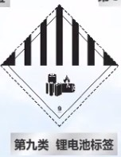
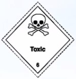
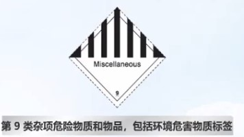
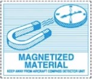
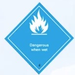
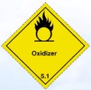

# 第 10 类飞行人员危险品初训试题(A 卷)

## 一、判断题(每题 2 分,共 36 分)

-   [x] 危险品是指在航空运输过程中，能对健康，安全、财产或环境造成危险,并在《技术細则》的危給品表中列明和根据此规则进行分类的物品或物质。

    -   危险品运输手册 1.1

    `本手册所称危险品是指在航空运输中，能对健康、安全、财产或环境构成危险，并在 ICAO《技术细则》的危险品表中列明和根据此规则进行分类的物品或物质。`

-   [x] 除非运営人所属国家另有授权，运输用以替换公司物资中的危验品的物品威物质时，必须遵守危給品规则的规定。
-   [x] 驾驶舱及乘有旅害的客舱不得装载作为货物运输的危险品。

    -   危险品运输手册 1.2 (4)

    `驾驶舱及乘有旅客的客舱不得装载作为货物运输的危险品。“仅限货机”的危险品不得装载在客机上及载有非机组成员的货机上。`

-   [x] 牙科遇械中可能含有符合危赖品标准的物品,如易燃树酲或溶剂、压缩或液化气体，汞或故射性物质。

    -   危险品运输手册 2.3.2 (11)

    `牙科器械，DENTAL APPARATUS：可能含有易燃树脂或溶剂、压缩或液化气体、汞或放射性物质。`

-   [ ] 84 消毒液不能作为手提行李或颇身携带，但可以当行李托运。
    -   属于第五类，不能托运 （课堂笔记）
-   [x] 对放射性物质的三种防护方法:时间、距离、屏蔽。
    -   课堂笔记
-   [x] 根据危险品所具有的危险程度的不同，危险品划分为三个包装等级，从 I 级包装到 III 级包装危险程度递减。
    -   <a href="../#一般规定" target="_blank">一般规定</a>
-   [ ] 粘贴 GHS 标签的化学品一定是危险品.
    -   课堂笔记
-   [ ] 危险品包装识别标记只包括运输专用名称和 UN 编号。

    -   <a href="../#标记" target="_blank">标记</a>

    `危险品的基本标记包括运输专用名称，UN 编号，托运人，收货人名称及地址`

-   [ ] 打火机里的燃料丁烷于易燃液体。
    -   易燃气体
-   [x] 雪崩敉援包内可能含有 2.2 项压缩气体。

    -   16.2.8.3 雪崩救援背包 （2）

    `（2）可内装含有净重不超过 200 毫克的 1.4S 项爆炸品的烟火引发装置，和含有 2.2 项压缩气体（不含次要危险性）的气瓶。`

-   [x] 出于保持旅客和机组的卫生为目的，运营人在航空器上配备的供一次或一系列飞行期间，在航空器上使用的含醇类洗手液和含醇类的清洁用品不受本手册的限制。
    -   机供品不算危险品
-   [ ] 装有易燃液体的野营炉，其液体被清空后，可以允许旅客作为手提行李带上飞机。
    -   危险品运输手册 16.9 危险品速查表
-   [x] 旅客不可在手提行李中携带医用水银温度计。

    -   课堂笔记，汞对金属有腐蚀作用
    -   危险品运输手册 16.9 危险品速查表

    `NO YES NO NO Medical or clinical thermometer, which contains mercury, one (1) per passenger for personal use, when in its protective case.医用或临床用水银温度计：供个人使用时，旅客和机组人员可以携带一支，但必须有安全包装。`

-   [ ] 危险品事故是指与危险品航空运输有关联，不一定发生在航空器上，但造成人员受伤财产损失、环境污染、起火、破损、溢出、液体或放射性物质渗漏或包装未能保持完好的其它情况。
    -   未找到依据
-   [ ] 只要额定能量不超过 100Wh，每位旅害可携带的备用锂电池无数量限制。
    -   <a href="../#锂电池行李运输-包括托运和手提" target="_blank">锂电池行李运输-包括托运和手提</a>
-   [ ] 被制造商认为有安全缺陷的和已损坏的锂电池按规定包装后才可以运输
    -   <a href="../#锂电池行李运输-包括托运和手提" target="_blank">锂电池行李运输-包括托运和手提</a>
-   [x] 国航禁止运输按照包装说明 965 运输的 UN3480 锂离子电池。
    -   <a href="../#锂电池货物运输" target="_blank">锂电池货物运输</a>

## 二、单项选擇题(毎题 2 分,共 36 分)

19. 如下系列危险品,国航可以收

    -   [x] A 联合国和桂规措包第
    -   B 中国始的丰放射性物质的例外包茄件
    -   C 警机机城上的人国建编性物质
    -   D 含有波体危投品的单一位装

20. 连常滿的交通温岭部 2016 年第 42 号令是指し(),

    -   A (中华人民共 FR 用空安全保卫条)
    -   B《中国民用航空危品运着管 U 定)
    -   [x] C 民用航空危险品运输管理规定
    -   D《中国民用航空安全检查版则)

21. 下面哪一项物品中可能念有危胎品?(

    -   A 服装
    -   B.健宋的活体动物
    -   [x] C 野营用具
    -   D 报刊杂志

22. 北京冬离会火施可能念有下列都中允岭品?

    -   A 是常液体
    -   B.易燃气体
    -   [x] C 易题固体
    -   D 以上都是

23. 第放射性物 Ti 的值为 9，其属于 摄放射性物质
    -   III
24. 金网锂属于

    -   A 爆炸品
    -   B.易烯液体
    -   C 易燃周体
    -   [x] D 遇水释放易燃气体的物质

25. 以下属于危验性标签的是().

    -   A 远离热源标签
    -   [x] B 毒性气体标签
    -   C 深冷液化气休标签
    -   D.仅服岱机标签

26. 含有锂离子电池的设备作为货物,按照 P1967 SectionI 运输时,是否需要 NOTOC (需要) 需要丐贴哪种标签? ()

    -   

27. 包装等级表示店检品的危检性大小和包装的严格程度 ，下列包装等级中 ，危险性最低的

    -   PG III

28. 运输中活体动物和(L)不能同时状态在没有通风的货舱，

    -   A 故射性物品
    -   [x] B 干冰
    -   C 里燃液体
    -   D 南性物团

29. 不能作为手提或随身拱学的电品只能作为托运行李的为し/).

    -   [x] A 电动轮椅
    -   B.念有经类气国的头发酒型设备
    -   C 产生热網的物品，例如水下手电的
    -   D 冷冻波氨的保温包镐

30. 每位旅者或机程人员允许来带的武式医疗电子设备，可以面过带种方式高带(D).

    -   A 手提行李 B 托运行李 C 随身携带行李 **D.都可以**

31. 31.每名旅畜或机组人员最多可以拱带(!)块便洗式电子设备备用电池，概过应通知 U 国航。经国航同商后方可运输。

    -   A.2
    -   B.8
    -   C 15
    -   [x] D.20

32. 根狐附航《允险虽运手册》集密及机组疾带危黯品的规定，每名旅育和机组成员所允许携带的滴緒饮料(波度大于 24%，不超过 70%)的总世为(し).

    -   A. 2 升
    -   B.25 升
    -   [x] C 5 升
    -   D.10 开

    `手册 16.2.9.7`

33. 危险品二氧化丽(Nitrogen dicxide)的应急代码为(口).

    -   [x] A.2PX
    -   B.2P
    -   C.2L
    -   D.2X

    `应急处置手册 UN1067`

34. 聚合彻频粒超过干克时，必须装载在可近进的货舱

    -   A.100
    -   B.200
    -   C.500
    -   [x] D.1000

35. -块锂电池的额定电压为 3.7V，额定容量为 20Ah，其般定能显(Wh)为().

    -   A 7.4Wh
    -   B.740Wh
    -   C.37Wh
    -   [x] D.74Wh

36. 单个锂电池驱动的电动轮椅(电池可以卸下),其锂电池的最大额定能量为(し).
    -   A.160Wh
    -   B.100Wh
    -   [x] C.300Wh
    -   D.150Wh

## 三、多项选择题(毎题 2 分,共 8 分。多选、错选、漏选不得分)

37. 下列两种危险物品需要隔离的是().

    -   A. 汽油&硫磺
    -   [x] B.硫酸&理金属
    -   [x] C.白磷&双氧水
    -   D. 水银&液氨

38. 以下物品或物质不属于危险品的是().

    -   [x] A. 食用油
    -   B. 干冰
    -   C. 充气篮球
    -   [x] D. 碳酸饮料

39. 面对狸电池引起的火灾或置烟等情况，下列应急措施错误的有(AD).

    -   [x] A. 找电地学相的火大只花使用木灭火器天火
    -   B. 可以使居水火火瓶：安伦天火龍特一 1 优近我保的灭火城大火
    -   C. 两火扑文后，使用水等不可诺液係吃菲电池壴季电池芯内部完全许温冷却
    -   [x] D. 明火扑叉后，可在电池上抹告一是冰块以健健他快冰群温

40. 放带有 GPS 定位女能的行李箱，内含街于 GPS 供电的建离子电池，总定能然为 3.9Wh ,要求

    -   [x] A. 如需托运且电池可拆，必和格理电池以行李植/包上拆下，电池作为手提行李带入客舱，
    -   B. 者电妆可折，规修梦合事提行年要承时，可以作为弄提行率機入餐脆
    -   [x] C. 若性电池不能拆下禁止作为行李送输
    -   D. 可以以任啊形式运给

## 危险品对应图片

-   老鼠药

    -   

-   作为货物运输的干冰

    -   

-   磁性物质

    -   
    -   

-   金属锂

    -   

-   化学氧气发生器

    -   
