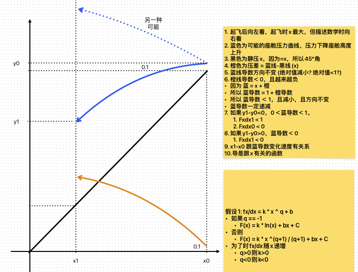

## Graph

## Blue Line

$$
if \space q = -1, \space z = \ln{|x|} \space , else \space z = \frac{x^{q+1}}{q+1}
\\ \space
\\ \space
f(x) = kz + bx + C
\\ \space
\\ \space
\frac{df(x)}{dx} = kx^q + b

$$

- $\frac{df(x)}{dx}$ decreases and $dx$ orange line decreases.
  - $k * q < 0$
- provided $(x_1, \frac{f(x)}{dx_1})$, $(x_0, \frac{f(x)}{dx_0})$ is on $kx^q + b$
  - $\frac{f(x)}{dx_1} * \frac{f(x)}{dx_0} > 0$
    - if not, $\frac{f(x)}{dx}$ changes too quickly
      - if $y_0 > y1$, set $\frac{f(x)}{dx_0} = 0$
      - if $y_0 < y1$, set $\frac{f(x)}{dx_1} = 0$
  - $\because x_1 < x_0 \And \frac{f(x)}{dx} decreases$ , $\therefore \frac{f(x)}{dx_1} > \frac{f(x)}{dx_0}$ is guaranteed.
    - if $y_1<y_0$, $0<\frac{f(x)}{dx_0}<\frac{f(x)}{dx_1}<1$ (实线蓝色), if not
      - set $\frac{f(x)}{dx_1}=1$
      - then, set $\frac{f(x)}{dx_0}>=0$
    - if $y_1>y_0$, $\frac{f(x)}{dx_0}<\frac{f(x)}{dx_1}<0$ (第二种可能)
      - make sure $\frac{f(x)}{dx_1} < 0$
      - otherwise set $\frac{f(x)}{dx_1}=0$
  - if $\frac{f(x)}{dx} = 0$
    - $y = C$

## With assumed k

$$

if \space q \not ={-1}, let \space \Delta z = \Delta(\frac{x^{q+1}}{q+1})
\\ \space
if \space q = -1, let \space \Delta z = \Delta(\ln{|x|})

\\ \space
\\ \space
\Delta y = k \Delta z + b\Delta x

\\ \space
\\ \space
\Delta y - k \Delta z =  b\Delta x

\\ \space
\\ \space
b = \frac{\Delta y - k * \Delta z}{\Delta x}

\\ \space
\\ \space
C = y - kz - bx

$$

## Re-solving k

- with $n = \frac{f(x)}{dx}$

$$

b = n - kx^q
\\ \space
\\ \space
\because b = \frac{\Delta y - k * \Delta z}{\Delta x}
\\ \space
\\ \space
\therefore  n - kx^q = \frac{\Delta y - k \Delta z}{\Delta x}
\\ \space
\\ \space
n - kx^q = \frac{\Delta y}{\Delta x} - k\frac{\Delta z}{\Delta x}
\\ \space
\\ \space
k\frac{\Delta z}{\Delta x}- kx^q = \frac{\Delta y}{\Delta x} - n
\\ \space
\\ \space
k(\frac{\Delta z}{\Delta x}- x^q) = \frac{\Delta y}{\Delta x} - n
\\ \space
\\ \space
k = (\frac{\Delta y}{\Delta x} - n) \div (\frac{\Delta z}{\Delta x}- x^q)

$$
